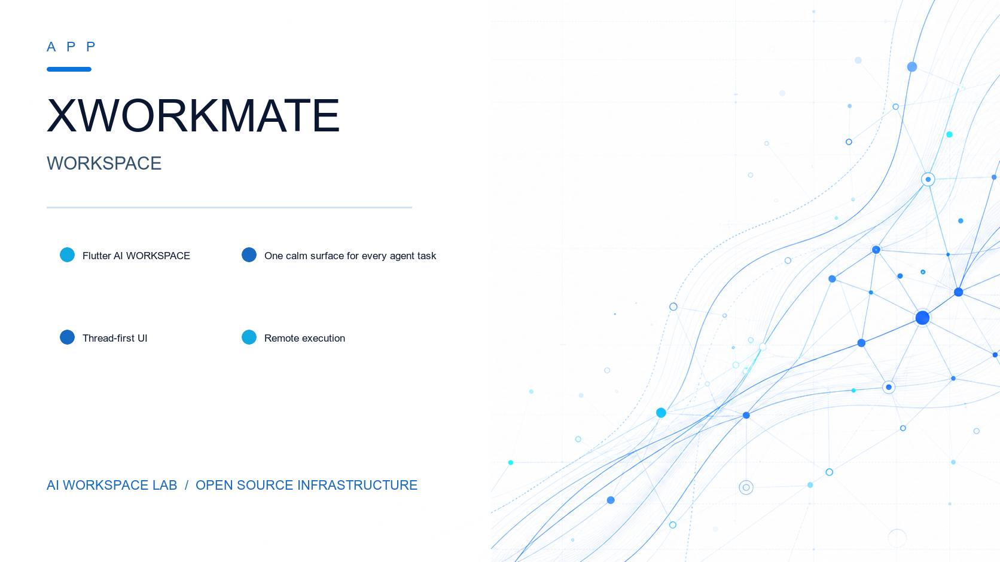

[](./LICENSE) [](https://flutter.dev/) [](https://dart.dev/) [](./README.md)

# xworkmate-app

Flutter-based AI workspace shell for running assistant threads with local and remote gateway task execution via ACP bridge.

## Development TL;DR

- `main` is the time axis.
- `tag` marks a release snapshot.
- `release/*` is the LTS maintenance line.
- Short-lived branches only: `feature/*`, `bugfix/*`, `hotfix/*`, `backport/*`, `cherry-pick/*`.
- `feature/*` and `bugfix/*` land in `main`.
- `hotfix/*` lands in `release/*`.
- `backport/*` goes from `main` to `release/*`.
- `cherry-pick/*` goes from `release/*` to `main`.
- Secret leaks: revoke first, then rewrite history.

## Architecture

Single product execution path: **Flutter → GoTaskServiceClient → xworkmate-bridge → OpenClaw Gateway → Work/Code workers**

See [docs/architecture/](./docs/architecture/) for the full architecture documentation.

## Dependencies

| Repository | Role |
| --- | --- |
| [xworkmate-bridge](https://github.com/x-evor/xworkmate-bridge) | Go-based ACP control plane and bridge backend |
| [xworkspace-core-skills](https://github.com/x-evor/xworkspace-core-skills) | Core skill bundles (pptx, docx, xlsx, pdf, image, browser automation) |
| [openclaw-multi-session-plugins](https://github.com/x-evor/openclaw-multi-session-plugins) | OpenClaw Gateway multi-session plugin runtime |
| [playbooks](https://github.com/x-evor/playbooks) | Deployment playbooks and infrastructure automation |

## Quick Start

```bash
git clone https://github.com/x-evor/xworkmate-app.git
cd xworkmate-app
flutter pub get
flutter analyze
flutter test
flutter run -d macos
```

For local development, keep `xworkmate-bridge` checked out alongside `xworkmate-app`, or set `XWORKMATE_BRIDGE_DIR` explicitly before building.

## macOS (Xcode)

```bash
open macos/Runner.xcworkspace
# or
make open-macos-xcode
```

In Xcode:
- Select the shared `Runner` scheme
- Select `My Mac` as the destination
- Configure signing only on the `Runner` target
- Leave CocoaPods plugin targets under `Pods` alone

For release builds:

```bash
flutter build macos
make build-macos
```

For a one-line install from the latest GitHub release:

```bash
curl -sfL https://install.svc.plus/xworkmate-app | bash -
```

## Downloads

| Platform | Download |
| --- | --- |
| macOS | [Latest Release](https://github.com/x-evor/xworkmate-app/releases/latest) |
| Windows | [Latest Release](https://github.com/x-evor/xworkmate-app/releases/latest) |
| Linux | [Latest Release](https://github.com/x-evor/xworkmate-app/releases/latest) |
| iOS | [Latest Release](https://github.com/x-evor/xworkmate-app/releases/latest) |
| Android | [Latest Release](https://github.com/x-evor/xworkmate-app/releases/latest) |

## Learn More

- [Architecture Overview](./docs/architecture/README.md)
- [Core Integration Test Cases](./docs/cases/README.md)
- [Cross-Repo Task State Workflow](./docs/architecture/cross-repo-task-state-workflow.md)
- [CHANGELOG](./CHANGELOG.md)

## Run Chat, Work, Coding and AutoBot

Keep the existing desktop layout and mobile shell. Choose Chat, Work, Coding or AutoBot in
the original desktop Gateway chip position or the mobile configuration mode chip.
All product requests follow App → authenticated Bridge → OpenClaw Gateway.
Connect the App to the managed Bridge endpoint with the account-managed secure
credential; the Bridge routes to OpenClaw. The Gateway deployment must configure
its central provider as `xworkmate`, expose that provider through `models.list`,
with a central model. Only live `xworkmate/<model>` catalog entries
are selectable for product execution. The App sends no provider credentials to
workers. Every product turn and new AutoBot schedule explicitly sends one validated
catalog ref. An empty catalog blocks submission and AutoBot creation; no unverified
Gateway default or local model preset is used. Existing AutoBot jobs retain their own
configured models when paused or inspected.

Work uses the Gateway's DSH ACP worker and Coding uses the pinned OpenCode v2
worker. Existing task progress, stop/recovery, file list and previews remain in
place. `code.diff`/`.patch`, `tests.log` and JSON test reports are rendered as
actual task artifacts. Exporting a report does not itself mean tests passed.
AutoBot selection opens scheduled-task management and uses real server-side cron creation, pause,
execution history and deletion. Notifications use configured Gateway channels
with explicit recipients; native APNs/FCM push is not implemented here.

For local verification, use the repository Flutter toolchain:

```sh
flutter pub get
flutter analyze
flutter test
flutter build macos --debug
flutter build apk --debug
flutter build ios --debug --no-codesign
flutter build ios --simulator --debug
python3 test/scripts/android_release_signing_test.py
```

The iOS project includes a CocoaPods fallback for plugins that do not yet use
Swift Package Manager. Its deployment target stays 15.5. Release APK/AAB builds
require a complete upload-keystore contract; the release script and Gradle
reject missing signing rather than emitting a debug-signed release. Use a debug
APK for local checks. Apple signing, Play signing, privacy/review submissions
and deployed worker/model integration are separate acceptance gates. This local
implementation is not evidence of App Store or Google Play approval.

The desktop/mobile composer has no Provider or Gateway/Agent route choice.
OpenClaw is the fixed execution provider behind Bridge. Central model selection
remains in existing settings/catalog controls; removing Provider does not remove
model configuration or introduce a direct vendor/OAuth route.
