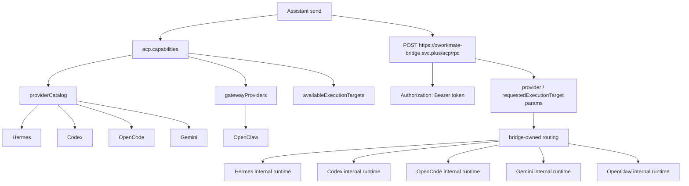

# Bridge Runtime Routing Map

Last Updated: 2026-04-21

本文记录 `xworkmate-app` 当前对 `xworkmate-bridge` 的运行时路由合同。UI 不直接承载这些路径；Assistant UI 仍由 `acp.capabilities` 返回的 `providerCatalog`、`gatewayProviders`、`availableExecutionTargets` 驱动。

App 侧任务发送只调用 bridge 主入口 `/acp/rpc`，不再拼接 provider-specific 直连 URL。Provider 与 gateway 的实际执行地址是 bridge 内部运行时事实，不属于 App contract。

## App Runtime Flow

## Routing Rules

- App runtime requests use `https://xworkmate-bridge.svc.plus/acp/rpc`.
- Provider and gateway selection are passed as request params, including `provider`, `routing`, and `requestedExecutionTarget`.
- Bridge-owned internal routing is opaque to the App; it is not represented as public provider paths.
- The app must not route managed bridge tasks to local or LAN endpoints such as `127.0.0.1:*` or `192.168.*:*`.
- The app must not route managed bridge tasks by directly constructing `/acp-server/*` or `/gateway/*` URLs.
- All App-side requests go through `https://xworkmate-bridge.svc.plus/acp/rpc`.
