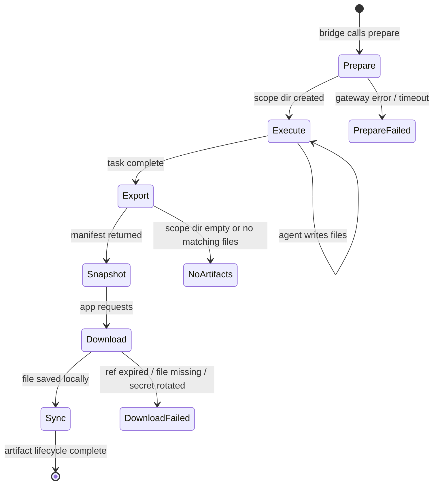

# Chain Map: Artifact Lifecycle (Prepare → Export → Read → Download)

Repo chain: openclaw-multi-session-plugins ↔ xworkmate-bridge ↔ xworkmate-app

## Lifecycle States

```
[prepare] → [execute] → [collect-and-snapshot] → [export] → [snapshot] → [download] → [sync]

  prepare:  mkdir tasks/<session>/<run>/          (multi-session-plugins)
  execute:  tools write files                      (openclaw.svc.plus)
  collect:  copy media/tmp outputs into task scope (multi-session-plugins)
  export:   scan + manifest + sign                 (multi-session-plugins)
  snapshot: assemble terminal result               (xworkmate-bridge)
  download: signed URL proxy                       (xworkmate-bridge)
  sync:     save to ~/.xworkmate/threads/<session>/ (xworkmate-app)
```

App terminal rule:
- `completed`, `failed`, `cancelled`, and `canceled` snapshots end task
  execution immediately.
- Artifact presence controls only `lastArtifactSyncStatus`; it is not a reason
  to keep `lifecycleStatus=running`.

## State 1: Prepare

```
Caller:   xworkmate-bridge → gateway.request('xworkmate.artifacts.prepare')
Handler:  openclaw-multi-session-plugins → prepareXWorkmateArtifacts()

Inputs:
  sessionKey:  string    // "agent:default:abc123"
  runId:       string    // "20260605-001"
  workspaceDir?: string  // optional explicit path

Process:
  1. resolveWorkspaceDir({ sessionKey, params, pluginConfig, config })
     → Falls back through: explicit → pluginConfig → agent config
       → profile env → ~/.openclaw/workspace

  2. safeScopeSegment(sessionKey)
     → replace [/\\:*?"<>|] with "-", truncate to 96 chars

  3. safeScopeSegment(runId) → same rules

  4. scopeRoot = <workspace>/tasks/<safeSessionKey>/<safeRunId>/
     → fs.mkdir(scopeRoot, { recursive: true })

  5. Validate: isWithinRoot(workspaceRoot, scopeRoot)

Output:
  artifactScope:  "tasks/<safeSessionKey>/<safeRunId>/"
  artifactDirectory: "<workspace>/tasks/<safeSessionKey>/<safeRunId>/"

Fragile:
  - workspace resolution chain has 5 ordered sources
  - session key format must match across bridge and plugin
  - no cleanup of old scope directories
```

## State 2: Execute (GAP)

```
During agent turn execution, OpenClaw tools write output files.
These go to various locations depending on the tool:

Tool: browser (screenshot / download)
  → screenshot: saveMediaBuffer(buffer, "image/png", "browser")
    → ~/.openclaw/media/browser/<uuid>.png
  → download:  writeExternalFileWithinOutputRoot()
    → requested download path (bounded by output root security)
  → uploads:   /tmp/openclaw/uploads/<file>

Tool: image-generation
  → Returns GeneratedImageAsset { buffer, mimeType } (in-memory)
  → Agent must explicitly write buffer to disk
    → Usually saveMediaBuffer(buffer, mimeType, "browser")
      → ~/.openclaw/media/browser/<uuid>.png

Tool: video-generation / rendering
  → Output to media/ outbound or /tmp/ rendering workspace

Tool: file-write (agent writes files explicitly)
  → May write to workingDirectory (pointed at tasks/<session>/<run>/)
  → OR may write to ~/.openclaw/agents/<id>/workspace/

═══════════════════════════════════════════════════════════
CRITICAL: None of these paths are inside tasks/<session>/<run>/
unless the agent explicitly directs output there.

The artifact export below will NOT find these files.
═══════════════════════════════════════════════════════════
```

## State 3: Collect And Snapshot

```
Caller:   xworkmate-bridge → gateway.request('xworkmate.artifacts.collect-and-snapshot')
Handler:  openclaw-multi-session-plugins → collectAndSnapshotXWorkmateArtifacts()

Inputs:
  sessionKey:    mapped OpenClaw session key
  runId:         OpenClaw run id
  artifactScope: tasks/<session>/<run>/
  sinceUnixMs:   task start timestamp

Process:
  1. Validate artifactScope matches sessionKey/runId.
  2. Scan fixed OpenClaw output roots:
     - ~/.openclaw/media/
     - /tmp/openclaw/
  3. Copy changed regular files into:
     - tasks/<session>/<run>/artifacts/media/...
     - tasks/<session>/<run>/artifacts/tmp-openclaw/...
  4. Skip symlinks and any path that escapes the fixed source roots.

Output:
  copiedFiles: relative paths under the current task scope
  warnings: skipped paths or unavailable source roots
```

## State 4: Export

```
Caller:   xworkmate-bridge → gateway.request('xworkmate.artifacts.export')
Handler:  openclaw-multi-session-plugins → exportXWorkmateArtifacts()

Inputs:
  artifactScope: "tasks/<session>/<run>/"
  workspaceDir?: string
  artifactRef?:   string   // alternative: read single artifact
  maxFiles?:      number   // default: 200
  maxInlineBytes?: number  // default: 512KB, files larger are omitted
  expectedArtifactDirs?: string[] // from session.start metadata.xworkmateTaskArtifactContract only

Process:
  1. resolveScopeRoot(workspaceRoot, artifactScope)
     → <workspace>/tasks/<session>/<run>/
     → Validate isWithinRoot()

  2. collectCandidates(scopeRoot)
     → Recursive walk of ONLY tasks/<session>/<run>/
     → Skip: .git, .openclaw, .xworkmate, .pi, .dart_tool,
             .next, .turbo, node_modules
     → Skip: symlinks (security measure)
     → Apply: artifact-ignore.md rules

  2b. If the task scope has no candidates and `expectedArtifactDirs` is present:
     → Scan only those explicit workspace-root subdirectories
     → Keep exported entries bound to the current task artifactScope
     → Do not scan the workspace root broadly and do not borrow older task scopes

Protocol boundary:
  `expectedArtifactDirs` is bridge artifact-contract data, not agent execution
  data. Bridge must not put it in `chat.send` params. Bridge must not probe old
  root-level or metadata-root compatibility keys.

  3. For each file under maxFiles limit:
     → Read content (up to maxInlineBytes)
     → Compute SHA-256 hash
     → Determine content-type from extension

  4. Build artifact manifest:
     {
       scope: "tasks/<session>/<run>/",
       sessionKey: "<sessionKey>",
       runId: "<runId>",
       totalCandidates: <N>,
       files: [
         { relativePath, displayPath, size, contentType, sha256, inline }
       ]
     }

  5. Generate signed refs:
     → signArtifactRef(sessionKey, runId, relativePath)
     → HMAC-SHA256(signingSecret, "<key>::<run>::<path>")
     → Valid for 24h

Output:
  manifest:  { scope, sessionKey, runId, totalCandidates, files[] }
  Each file: { relativePath, displayPath, size, contentType, sha256, inline?, ref }

Fragile:
  - Export only scans tasks/<session>/<run>/; collect-and-snapshot must run first for global tool outputs
  - symlinks rejected even if pointing within workspace
  - maxFiles=200, maxInlineBytes=512KB — large files silently omitted
  - signing secret rotation invalidates all existing refs
```

## State 5: Snapshot (Bridge)

```
Caller:   completeOpenClawTask() in openclaw_async_tasks.go
          triggered by probeOpenClawTask() detecting completion

Process:
  1. Call gateway.request('xworkmate.artifacts.collect-and-snapshot')
     → Copy OpenClaw media/tmp outputs into the task scope

  2. Call gateway.request('xworkmate.artifacts.export')
     → Get manifest from plugin

  3. openClawArtifactExport()
     → Transform manifest files into stable result shape
     → decorateOpenClawArtifactDownloadURLs()
       → Replace each file.ref with signed download URL:
         /artifacts/openclaw/download?ref=<signed>&t=<expiry>

  4. Build terminal snapshot:
     {
       success: true,
       status: "completed",
       sessionId: "<id>",
       threadId: "<id>",
       turnId: "<id>",
       runId: "<id>",
       text: "<agent final output>",
       artifacts: {
         items: [{ path, url, sha256, size, contentType }],
         scope: "tasks/<session>/<run>/"
       }
     }

  5. Store snapshot for xworkmate.tasks.get queries

  6. Send SSE session.update to app

Fragile:
  - If export returns empty manifest, snapshot has no artifacts
  - Artifact download URLs expire after 24h
  - Snapshot stored only in memory (lost on bridge restart)
  - App execution state must still transition to ready for any terminal
    snapshot. Empty or incomplete artifact manifests update only artifact sync
    status; they must not keep the task lifecycle running.
```

## State 6: Download (Bridge Proxy)

```
Endpoint: GET /artifacts/openclaw/download?ref=<signed>&t=<expiry>

Handler: HandleOpenClawArtifactDownload() in openclaw_artifact_download.go

Process:
  1. Parse signed ref: <sessionKey>::<runId>::<relativePath>::<hmac>
  2. Verify HMAC signature against signing secret
  3. Check expiry (24h TTL, t=<unixSeconds>)
  4. Resolve artifact:
     → Build artifactScope: tasks/<session>/<run>/
     → Call gateway.request('xworkmate.artifacts.read',
          { artifactScope, relativePath })
     → Up to 3 retries on failure

  5. Plugin's readXWorkmateArtifact():
     → resolveScopeRoot(workspaceRoot, artifactScope)
     → Verify isWithinRoot()
     → Resolve file path: <workspace>/tasks/<session>/<run>/<relativePath>
     → Check file exists and not a symlink (reject symlinks to outside)
     → Read file content (up to 64MB max)
     → Return { content, contentType, size, sha256 }

  6. Bridge streams response:
     → Content-Type from artifact metadata
     → Content-Length header
     → Supports Range header for partial content
     → Validate SHA-256 of received content

Fragile:
  - Ref expiry: links stale after 24h
  - Secret rotation: all existing refs invalid
  - 64MB size limit
  - Symlink rejection: if agent created a symlink, download fails
  - 3 retry attempts only — persistent gateway failure = permanent 502
```

## State 7: Sync (App)

```
Location: xworkmate-app
  lib/runtime/desktop_thread_artifact_service.dart
  lib/app/app_controller_desktop_thread_actions.dart

Process:
  1. Receive terminal snapshot from bridge (SSE or task.get)
  2. Check success=true AND artifacts.items[] present
  3. For each artifact item:
     → Download via bridge's artifact download URL
     → Write to local workspace: ~/.xworkmate/threads/<session>/<artifact-relative>
  4. Update TaskThread state:
     → lastArtifactSyncStatus = synced
     → lastTaskArtifactRelativePaths = [downloaded paths]
     → lastResultCode = success

Failure paths:
  - success=false → lastResultCode=failed
  - success=true, no artifacts → lastArtifactSyncStatus=no-exported-artifacts
  - download failed → lastArtifactSyncStatus=failed
  - artifact missing from source → OPENCLAW_REQUIRED_ARTIFACT_MISSING

Fragile:
  - Local workspace may have stale artifacts from previous runs
  - Concurrent writes to same thread directory (multiple turns)
  - Large artifact downloads block UI thread
```

## Full State Machine



## Path Resolution Reference

| Layer | What | Default Path |
|-------|------|-------------|
| Plugin workspace | resolveWorkspaceDir() | `~/.openclaw/workspace` |
| Plugin scope | tasks/<session>/<run>/ | `<workspace>/tasks/<s>/<r>/` |
| Plugin export | exportXWorkmateArtifacts() | Scans only scope dir |
| Bridge snapshot | completeOpenClawTask() | In-memory, 24h signed URLs |
| Bridge download | /artifacts/openclaw/download | Proxied from plugin read |
| App sync | syncArtifactsFromBridge() | `~/.xworkmate/threads/<s>/` |
| OpenClaw media | saveMediaBuffer(subdir) | `~/.openclaw/media/<subdir>/` |
| OpenClaw temp | resolvePreferredOpenClawTmpDir() | `/tmp/openclaw/` |
