# Chain Map: Session Recovery

Repo chain: xworkmate-app → xworkmate-bridge

## Recovery Scenarios

### S1: App restart with running task

```
App starts
  └─ AppController.restoreTaskThreads()
     └─ ThreadStorage.loadAllThreads() → TaskThread[]
        └─ For each thread with lifecycleStatus=running:
           └─ resolveGatewayThreadConnectionState()
              ├─ thread has pendingTurnId?
              │   ├─ Yes → pollBridgeTaskSnapshot(turnId)
              │   │   └─ xworkmate.tasks.get({ sessionId, threadId, turnId })
              │   │       ├─ Terminal snapshot found → apply result and mark ready
              │   │       ├─ Session not found → mark failed
              │   │       └─ No response → mark unrecovered
              │   └─ No → mark ready (no pending turn)
              │
              └─ thread lifecycleStatus=queued?
                 └─ drainOpenClawGatewayQueue() → re-send

Key files:
  lib/app/app_controller_desktop_thread_sessions.dart
  lib/runtime/external_code_agent_acp_desktop_transport.dart
```

### S1a: App update / reinstall on iOS (container UUID moved)

iOS assigns the app data container a new UUID on every update or reinstall.
`threads.json` itself moves with the container, but each persisted
`workspaceBinding.workspacePath` is an absolute path that still names the old
container root, so every managed `localFs` binding goes stale at once.

```
App starts (new container UUID)
  └─ restoreAssistantThreadsInternal(records)
     └─ For each record with workspaceKind=localFs, app-owned sessionKey,
        and a managed-shape path (…/.xworkmate/threads/<name>):
        └─ localThreadWorkspacePathInternal(sessionKey)  → canonical path
           under the CURRENT base (iOS: app Documents; desktop: $HOME)
           ├─ differs from stored path → rebase binding to canonical
           │   (workspacePath + displayPath), count the migration
           └─ equal → keep as-is
  └─ rebased count > 0 → saveTaskThreads(all records) once, so the next
     launch (and any on-disk inspection) no longer sees old-container paths
```

Non-managed custom `localFs` paths are never touched — only the managed
layout is derivable from the sessionKey. Active sessions would also self-heal
via `ensureDesktopTaskThreadBindingInternal` on activation; the restore-time
rebase exists for historical threads that are never activated but whose
paths are still read directly (artifact sync guards, workspace reveal).

Key files:
  lib/app/app_controller_desktop_thread_storage.dart (restoreAssistantThreadsInternal)
  lib/app/app_controller_desktop_thread_binding.dart (isManagedLocalThreadWorkspacePathInternal, localThreadWorkspacePathInternal)
  lib/app/app_controller_desktop_settings_runtime.dart (persist-once after rebase)

### S2: Bridge restart (all sessions lost)

```
Bridge sends SSE close / WebSocket disconnects
  └─ App: ExternalCodeAgentAcpDesktopTransport detects disconnect
     └─ Enter recovery mode
        ├─ Attempt reconnection to bridge /acp
        ├─ If reconnected:
        │   └─ Call xworkmate.tasks.get for each pending task
        │       ├─ Task found → continue with snapshot
        │       └─ Session not found (all sessions lost)
        │          → Mark task as failed with ACP_BRIDGE_RESTART
        └─ If cannot reconnect:
           └─ Exponential backoff, max retries
              → Eventually mark as ACP_UNREACHABLE

Key files:
  lib/runtime/gateway_runtime_core.dart (reconnection logic)
  lib/runtime/external_code_agent_acp_desktop_transport.dart (recovery)
```

### S3: Network interruption mid-task

```
SSE stream interrupted (network flap)
  └─ App: Transport detects stream close without terminal
     └─ Enter polling mode
        └─ Every N seconds: xworkmate.tasks.get({ sessionId, threadId, turnId })
           ├─ Terminal snapshot → apply result, mark ready, stop polling
           ├─ Still running → continue polling
           ├─ Session not found → mark failed
           └─ Max poll attempts reached → mark unrecovered

Critical parameters (check actual values in code):
  - poll interval: ? seconds
  - max poll attempts: ?
  - total poll timeout: ?

Key files:
  lib/runtime/external_code_agent_acp_desktop_transport.dart
```

### S4: OpenClaw gateway unreachable

```
Bridge side:
  └─ Gateway client: gatewayruntime/runtime.go
     └─ scheduleReconnect() with 2s delay
        └─ Suppressed for auth errors
        └─ openClawSilentFailureExceeded() → 10 min timeout
           └─ Mark task as OPENCLAW_GATEWAY_LOST

App side:
  └─ Receives SSE session.update with status=failed
     └─ applyGatewayChatResult() → lastResultCode=OPENCLAW_GATEWAY_LOST
     └─ TaskThread lifecycleStatus → ready
```

### S4a: Agent fails before producing output

```
OpenClaw agent_end(success=false, runId, error)
  └─ openclaw-multi-session-plugins persists xworkmate.taskRuns[runId]
     └─ App polls xworkmate.tasks.get
        └─ Native detached-task record absent
           └─ Plugin returns durable status=failed + sanitized error
              └─ Bridge preserves terminal failure (no artifact wait)
                 └─ App clears pending and shows the model/provider error

expectedArtifactDirs remain scan hints. An empty reports/ or artifacts/
directory cannot convert this terminal failure back to running.
```

### S5: App resend on OpenClaw lane busy

```
App: sendChatMessage() with executionTarget=gateway
  └─ isOpenClawLaneIdle() → false (5 active tasks)
     └─ queueOpenClawGatewayWork()
        ├─ lifecycleStatus = queued
        ├─ Position in queue: N (max 20)
        ├─ Queue timeout: 10 min
        └─ drainOpenClawGatewayQueue()
           ├─ Poll for lane idle + position=0
           ├─ Lane becomes idle:
           │   └─ Dequeue → send normally
           └─ Queue timeout:
              └─ lifecycleStatus = ready
              └─ lastResultCode = OPENCLAW_GATEWAY_BUSY

Note: The app-side queue is SEPARATE from bridge-side admission gate.
Bridge also has its own 5/20/10min admission control.

Double queue scenario:
  App queue (5/20) → waits → sends to bridge
  Bridge queue (5/20) → waits → sends to OpenClaw

Potential issue: App queue drains after lane idle, but bridge gate
might also be busy → further delay not visible to app UI.
```

## Recovery State Machine

```mermaid
stateDiagram-v2
  [*] --> Running: task submitted
  Running --> Running: SSE streaming
  Running --> Lost_Connection: socket close / network flap

  Lost_Connection --> Polling: xworkmate.tasks.get
  Polling --> Recovered: terminal snapshot
  Polling --> Polling: still running
  Polling --> Session_Not_Found: bridge restarted
  Polling --> Max_Retries: exceeded

  Recovered --> Ready: result applied; artifact sync status records missing outputs
  Session_Not_Found --> Failed: ACP_BRIDGE_RESTART
  Max_Retries --> Failed: ACP_UNRECOVERABLE

  Running --> Failed: task error / gateway lost
  Failed --> Ready: error recorded
```



## Bridge Session Store (Memory-Only)

```
xworkmate-bridge: internal/acp/types.go
  Server struct {
    sessions map[string]*session  // ← IN-MEMORY ONLY
  }

session struct {
  id           string
  threadId     string
  turnId       string
  runId        string
  sessionKey   string
  openclaw     *OpenClawTaskRecord  // nil for non-gateway sessions
  history      []message
  ...
}

No persistence:
  - Bridge restart → all sessions lost
  - xworkmate.tasks.get returns "session not found"
  - App must detect and mark as failed
```

## Key Bridge RPC Methods for Recovery

| Method | Params | Returns |
|--------|--------|---------|
| `xworkmate.tasks.get` | appThreadKey, openclawSessionKey, runId/taskId | Native task snapshot, durable agent_end run snapshot, or structured lookup error |
| `xworkmate.tasks.cancel` | appThreadKey, openclawSessionKey, runId/taskId | Cancel confirmation |
| Removed: Bridge task reassociation | artifactScope/runId-derived taskHandle | No longer supported; route through native task registry |

## App Recovery Flow (Detailed)

```
resolveGatewayThreadConnectionState(thread)
  ├─ thread.lifecycleStatus == "queued"
  │   └─ drainOpenClawGatewayQueue()
  │
  ├─ thread.lifecycleStatus == "running"
  │   ├─ thread.lastTurnId exists?
  │   │   ├─ Yes → transport.pollBridgeTaskSnapshot(turnId)
  │   │   │   └─ xworkmate.tasks.get:
  │   │   │       ├─ completed/failed → applyGatewayChatResult() and mark ready
  │   │   │       ├─ running → leave as running, continue SSE
  │   │   │       └─ not found / error:
  │   │   │          ├─ isBridgeAvailable()
  │   │   │          │   ├─ Yes → bridge restarted, mark failed
  │   │   │          │   └─ No  → network issue, retry later
  │   │   │          └─ set lifecycleStatus = ready
  │   │   │             set lastResultCode = ACP_SESSION_NOT_FOUND
  │   │   │
  │   │   └─ No → set lifecycleStatus = ready (no pending turn)
  │   │
  │   └─ no lastTurnId → ready
  │
  └─ thread.lifecycleStatus == "ready" || "archived"
     └─ No recovery needed
```

## Fragile Points for Recovery

1. **R1: Bridge restart detection**: App must distinguish "bridge restarted, sessions lost" from "network temporarily down". Currently relies on `xworkmate.tasks.get` returning "not found" while bridge is reachable.

2. **R2: Double queuing**: App has its own queue, bridge has admission gate. If both are congested, total wait time can exceed user expectations.

3. **R3: Stale running state**: If app crashes mid-task, on restart the thread shows lifecycleStatus=running. The xworkmate.tasks.get probe is the only way to resolve.

4. **R4: Polling parameters**: Hardcoded poll interval/retry values in `ExternalCodeAgentAcpDesktopTransport` need to align with bridge's task deadlines (10/30/60 min). If polling stops before deadline, app marks failed while task is still running.

5. **R5: OpenClaw handle expiration**: The bridge's in-memory `OpenClawTaskRecord` is not authoritative after restart. The plugin's SessionEntry-backed agent_end record preserves known terminal states; runs that ended before this record was written still fall back to the bounded deadline path.
