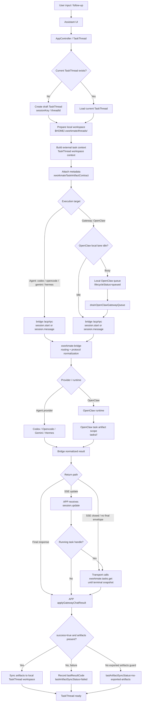
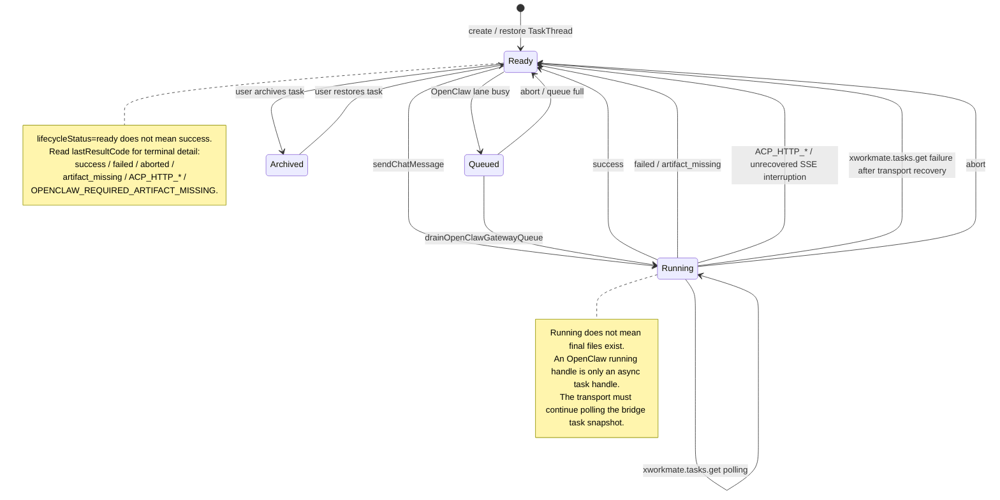
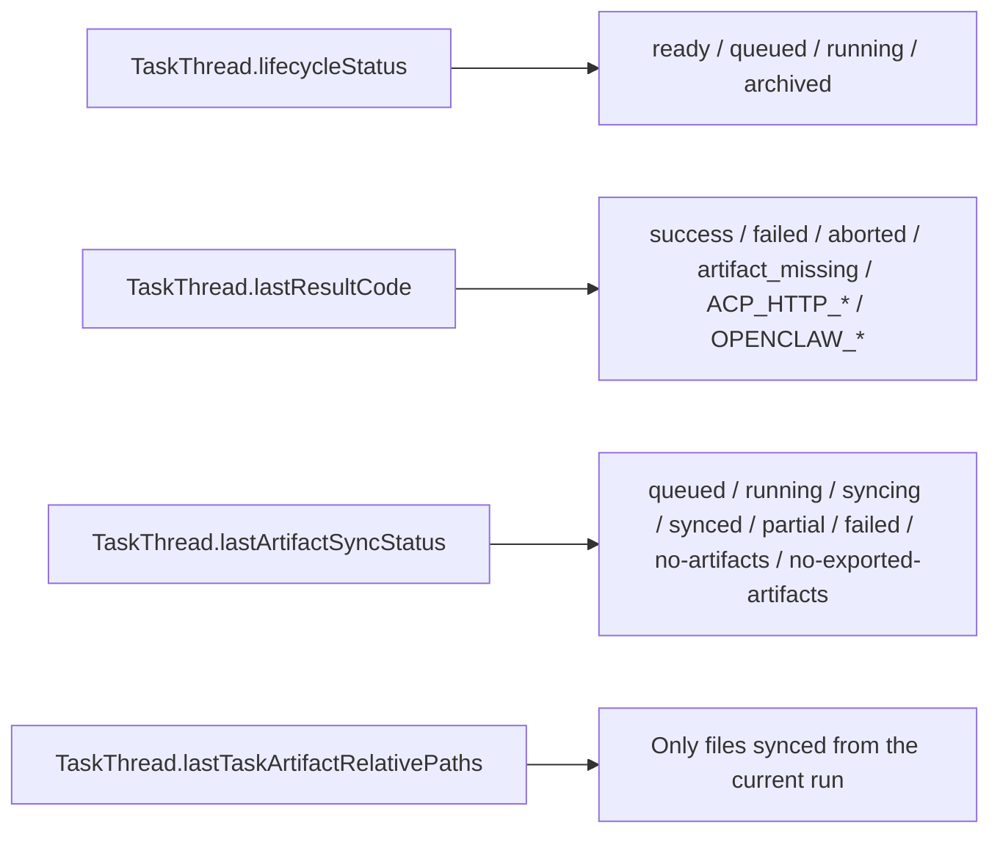
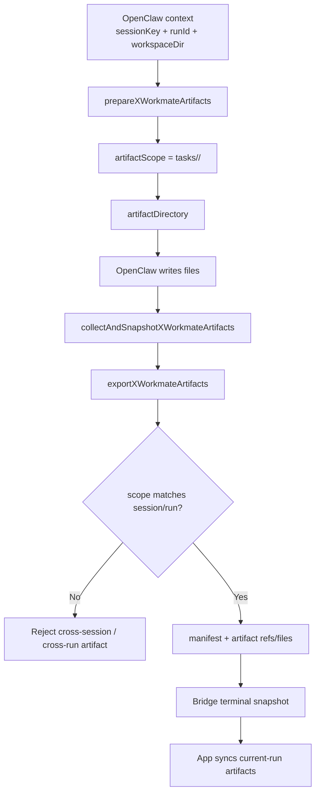

# Cross-Repo TaskThread Workflow

This document is the current TaskThread workflow record across:

- `xworkmate-app`
- `xworkmate-bridge`
- `openclaw-multi-session-plugins`

It replaces older local-classification and app-side artifact fallback descriptions. The current rule is:

> The app owns TaskThread state and local sync. The bridge/OpenClaw terminal task snapshot is the truth source for final artifacts.

## Ownership

### xworkmate-app

The app owns local state and UI only:

- Resolve or create the current `TaskThread` by `sessionKey` / `threadId`.
- Ensure the local workspace at `$HOME/.xworkmate/threads/<session>`.
- Build the external `TaskThread workspace context` prompt prefix.
- Send `metadata.xworkmateTaskArtifactContract`.
- Queue OpenClaw gateway work locally when the constrained OpenClaw lane is busy.
- Apply normalized bridge results to `TaskThread.lifecycleState`.
- Sync bridge-provided artifacts into the local TaskThread workspace.

The app must not infer required final file types from user text. It must not treat partial artifacts as final deliverables.

### xworkmate-bridge

The bridge owns the public protocol boundary:

- Expose the unified `/acp/rpc` entrypoint.
- Resolve routing for agent providers and gateway/OpenClaw.
- Normalize provider/OpenClaw results into a stable result shape.
- Map app `threadId` to an explicit OpenClaw `sessionKey`; do not pass app draft keys directly to OpenClaw.
- Stream `session.update` events.
- Serve `xworkmate.tasks.get` snapshots for asynchronous recovery and terminal result lookup.
- Serve `xworkmate.tasks.cancel` for OpenClaw task cancellation.

The bridge should return standard contract fields such as `artifacts`, `artifacts.items`, `files`, or `attachments`. App-side support for ad hoc final-artifact field names is not a compatibility layer.

### openclaw-multi-session-plugins

OpenClaw plugins own execution-time artifact scope:

- Create a run.
- Allocate `runId`.
- Prepare `artifactScope = tasks/<session>/<run>`.
- Execute the user task.
- Collect OpenClaw media/tmp tool outputs into the current task artifact scope after `agent.wait`.
- Export real final deliverables into the current task artifact scope.
- Validate that artifact scope matches the current session and run.
- Return artifact refs/files to the bridge.

Text-only file claims, placeholder files, global workspace files, previous-run files, and partial/intermediate artifacts are not final deliverables.

## Main Flow

## TaskThread State Machine

`TaskThread.lifecycleState.status` is intentionally small. Most terminal outcomes return to `ready`; result detail is stored in `lastResultCode`.

## State Field Relationship

Rules:

- `lifecycleStatus=ready` only means no task is currently running.
- Success or failure is read from `lastResultCode`.
- The artifact panel reads `lastArtifactSyncStatus` and `lastTaskArtifactRelativePaths`.
- `lastTaskArtifactRelativePaths` must only contain artifacts from the current run.

## App Request Contract

App requests to bridge use the unified ACP entrypoint. OpenClaw is selected with routing metadata, not with an app-facing OpenClaw URL.

The app sends:

- `sessionId`
- `threadId`
- `prompt`
- `workingDirectory`
- `remoteWorkingDirectoryHint`
- `routing`
- `metadata.xworkmateTaskArtifactContract`

For Gateway/OpenClaw, the app injects `currentTaskWorkspace` into both prompt context and metadata. The remote runtime must export final files into the current task artifact scope before returning success.

The prompt context contains:

- `sessionKey`
- local workspace
- remote workspace hint when available
- current task workspace
- workspace isolation rules
- final artifact contract rules

The local transcript stores the user's original text. Internal workspace context is only sent to the external task runtime.

## Bridge / OpenClaw Async Contract

The transport handles these bridge methods:

- `session.start`: start a new turn.
- `session.message`: continue an existing TaskThread.
- `xworkmate.tasks.get`: recover or query terminal task snapshot.
- `xworkmate.tasks.cancel`: cancel a running OpenClaw task.

Important recovery rule:

> A running OpenClaw task handle is never a final result.

When `session.update` contains `status=running` with `runId` and `artifactScope`, the app transport must use those fields only as query parameters for `xworkmate.tasks.get`. It must continue polling until the bridge returns a terminal snapshot:

- `completed` with artifacts -> success path.
- `failed`, `artifact_missing`, `cancelled`, or `canceled` -> failure path.
- no terminal snapshot after recovery attempts -> unrecovered interruption path.

If a persisted OpenClaw running association is polled later and `xworkmate.tasks.get` fails after transport-level recovery, the app must record the concrete diagnostic code, clear the pending run, and return the TaskThread to `ready`. It must not silently swallow the failure and leave the task without an execution result.

## Artifact Rules

The app syncs artifacts only when the bridge/OpenClaw terminal result establishes them as current-run final artifacts.

Valid success:

- `success=true`
- terminal bridge/OpenClaw snapshot
- standard artifact contract fields are present
- artifact scope belongs to the current session and run

Failure / no-sync cases:

- `success=false` with partial artifacts
- `OPENCLAW_REQUIRED_ARTIFACT_MISSING`
- `artifact_missing`
- `no-exported-artifacts`
- text-only file/path claims
- files from previous runs
- files from global OpenClaw workspace/cache
- placeholder artifacts generated by a guard

`openclaw returned partial artifacts without required final deliverables` means the remote artifact contract was not satisfied. It is not an app-side UI classification failure.

## OpenClaw Artifact Scope

## Boundary Rules

- The app does not store or construct OpenClaw runtime URLs.
- OpenClaw `session.start` and `session.message` use `/acp/rpc` with explicit routing metadata.
- `/gateway/openclaw` and provider-specific paths are not app-facing paths.
- The bridge/OpenClaw terminal task snapshot is the final artifact truth source.
- App local workspace contents are not used to decide whether a remote run produced final deliverables.
- Compatibility/fallback fields for final artifacts are not allowed unless an explicit bridge contract requires them.
