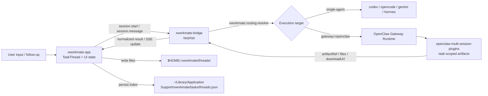
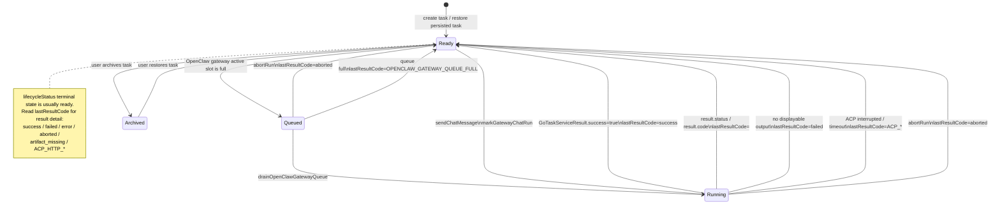
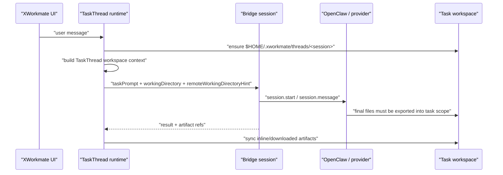
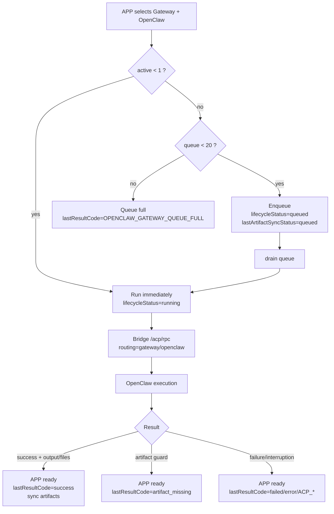
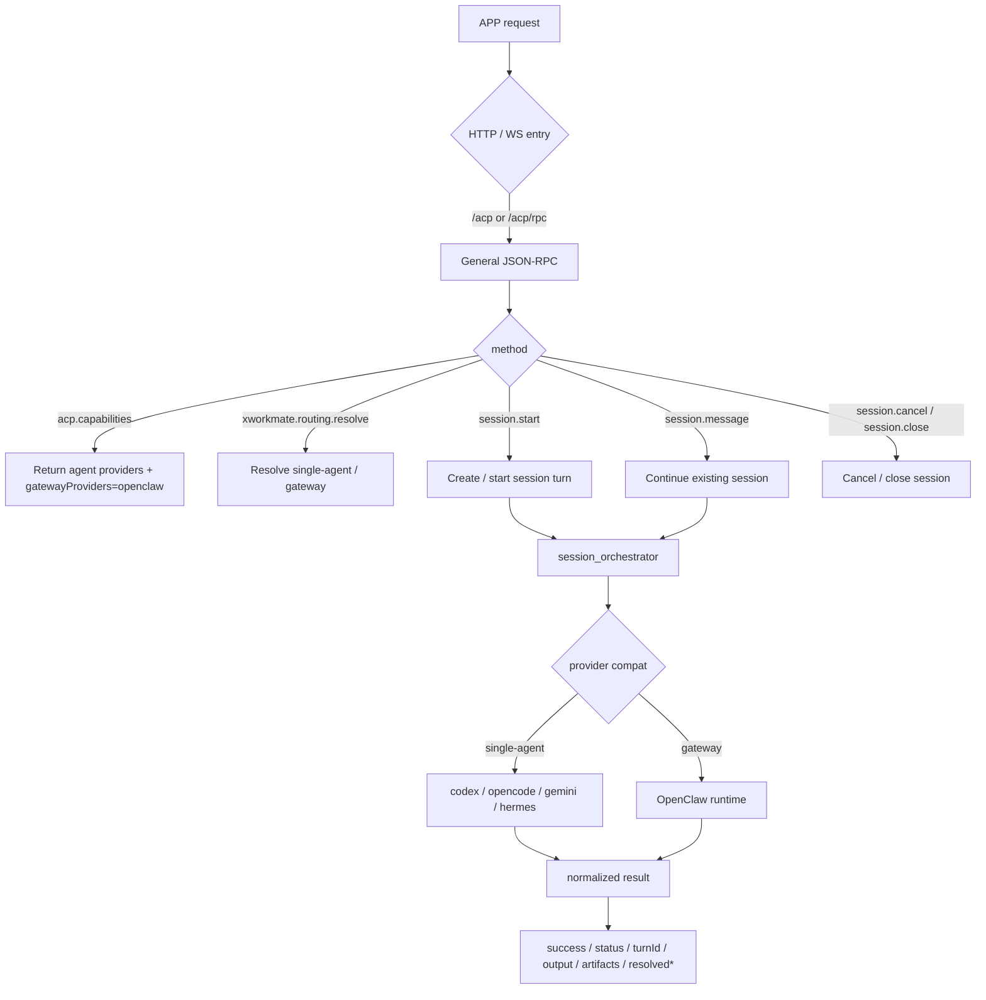
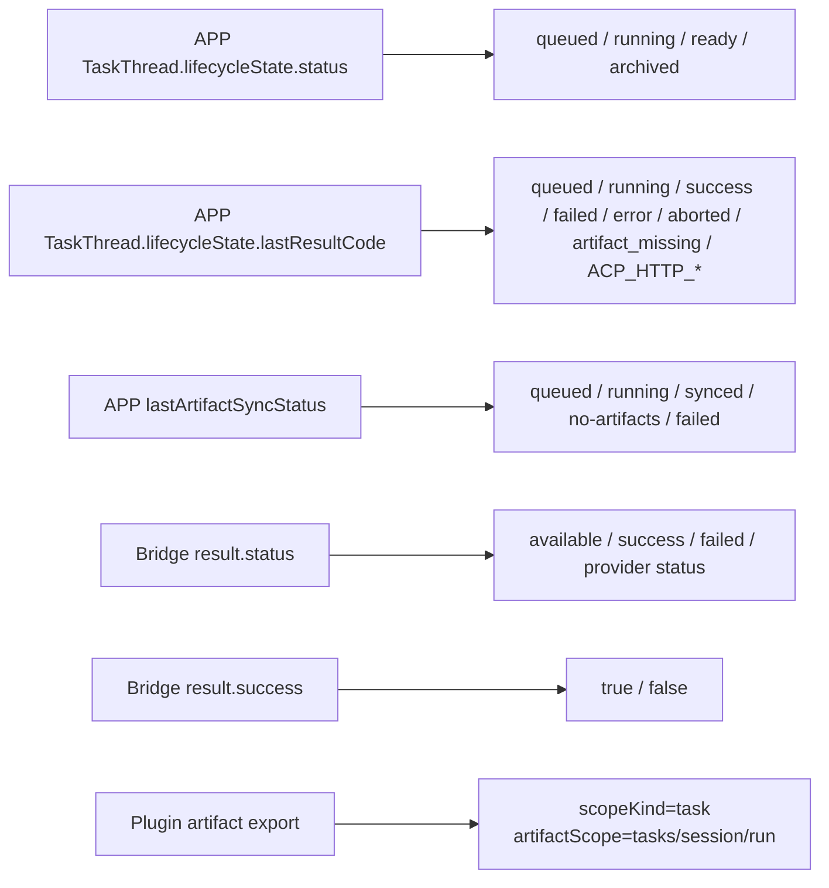

# Cross-Repo Task State Workflow

This document records the task-state workflow across:

- `xworkmate-app`
- `xworkmate-bridge`
- `openclaw-multi-session-plugins`

The core ownership split is:

- `xworkmate-app` owns task UI state, `TaskThread` persistence, local thread workspaces, and the OpenClaw submit queue.
- `xworkmate-bridge` owns public session/routing contracts, provider compatibility, normalized results, and OpenClaw task-submit routing.
- `openclaw-multi-session-plugins` owns OpenClaw task-scoped artifact preparation, export, and artifact-scope isolation.

## Overall Flow



## App TaskThread State Machine

`TaskThread.lifecycleState.status` is intentionally small. Most terminal outcomes return to `ready`; the specific terminal result is stored in `lastResultCode`.



## Task Workspace Context Injection

Every app-owned task has a local workspace under `$HOME/.xworkmate/threads/<session>`. For remote execution, the bridge/runtime may also resolve a remote task workspace hint. The app passes the task workspace in two ways:

- Structured request fields: `workingDirectory` and, when available, `remoteWorkingDirectoryHint`.
- External conversation context: a `TaskThread workspace context` prefix is added to the prompt sent to Bridge/OpenClaw.

The local chat transcript still stores the user's original text. Only the external task prompt is enriched, so the UI does not show internal workspace rules as user content.



Prompt-level workspace rules are deliberately strict. `remoteWorkingDirectoryHint` is the writable task workspace for remote OpenClaw/provider execution when present; otherwise `workingDirectory` is used.

- Treat the current task workspace as the only writable workspace for the task execution.
- Create, modify, and export task files inside that workspace or its task artifact scope.
- Do not use global OpenClaw media/cache paths, `/tmp`, Downloads, Desktop, or other arbitrary directories as final deliverable locations.
- If a tool creates output outside the task workspace, copy/export the final deliverables into the task workspace before claiming completion.
- Prefer local task-workspace paths, or paths relative to that workspace, when reporting files back to the user.

## OpenClaw Gateway Queue

The app serializes OpenClaw gateway execution locally because OpenClaw task execution is treated as a constrained gateway lane.



## Bridge Session And Routing Workflow

The bridge exposes one public session contract while keeping provider-specific behavior behind bridge-owned routing. OpenClaw task submit uses `/acp/rpc` with explicit gateway routing metadata, not a separate app-facing path.



## OpenClaw Plugin Artifact Scope

OpenClaw artifacts are scoped by task session and run. This prevents one task or turn from borrowing files from another.

```mermaid
flowchart TD
  CTX["OpenClaw plugin context<br/>sessionKey + runId + workspaceDir"] --> PREP["prepareXWorkmateArtifacts"]
  PREP --> SCOPE["artifactScope = tasks/<sessionKey>/<runId>"]
  SCOPE --> DIR["artifactDirectory"]
  DIR --> RUN["OpenClaw writes files"]
  RUN --> EXPORT["exportXWorkmateArtifacts"]
  EXPORT --> VALIDATE{"scope matches sessionKey/runId ?"}
  VALIDATE -->|no| ERR["Reject cross-task / cross-run artifact"]
  VALIDATE -->|yes| MANIFEST["manifest + artifactRef + files"]
  MANIFEST --> BR["Bridge result"]
  BR --> APP["APP downloads or inlines into local thread workspace"]

  note right of SCOPE
    Concurrent task isolation is based on:
    tasks/<session>/<run>
    Do not reuse other sessions or previous run files.
  end note
```

## Status Field Mapping



## Boundary Rules

- The app does not store OpenClaw URLs. It only consumes bridge capabilities where `gatewayProviders` includes `openclaw`.
- OpenClaw `session.start` and `session.message` use `/acp/rpc` with explicit OpenClaw gateway routing metadata; `/gateway/openclaw` is not an app-facing endpoint.
- Follow-up conversation uses the same `sessionKey` / `threadId`. Bridge `session.message` must continue the provider session state or return a structured continuation error.
- Artifact ownership is enforced by `openclaw-multi-session-plugins` with `tasks/<session>/<run>` scope. The app syncs only the current run's artifacts into the local thread workspace.
- Upgrade/install flows must preserve real local history. Cleanup must only remove explicitly known test-pollution session keys.
