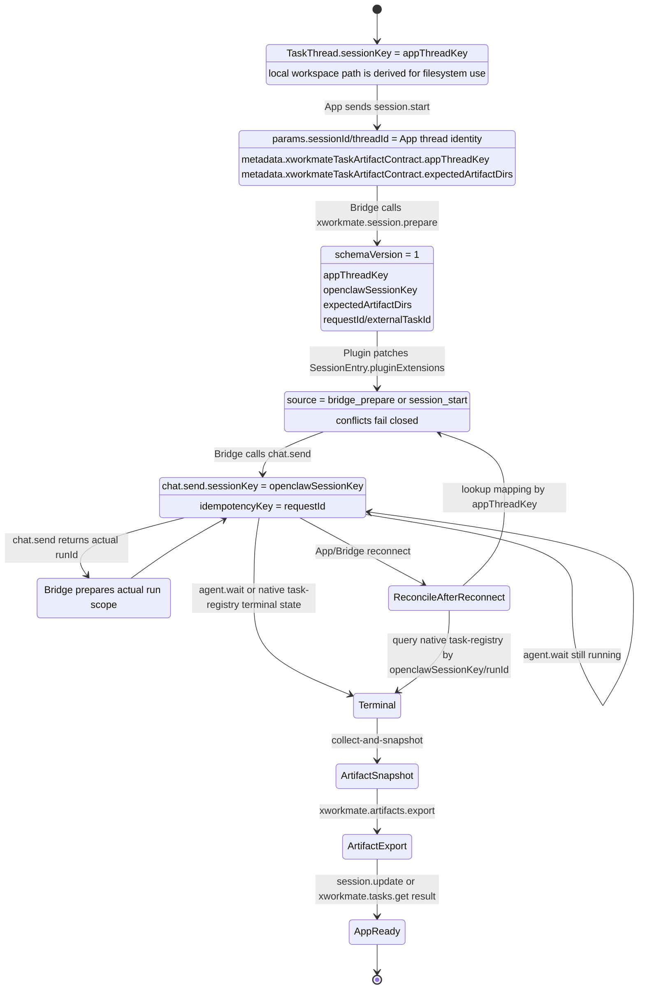
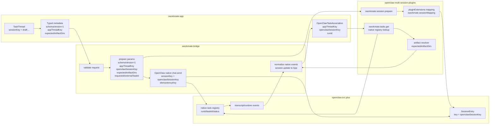

# OpenClaw Session Key State And Data Flow

This note is the source-of-truth for the XWorkmate App -> Bridge -> OpenClaw
session identity boundary.

## Terms

| Term | Owner | Example | Meaning |
| --- | --- | --- | --- |
| `TaskThread.sessionKey` | XWorkmate App | `draft:1780658097668838-1` | App-local thread identity. It owns UI state, queue state, local workspace, and persisted TaskThread data. |
| `appThreadKey` | XWorkmate typed integration metadata | `draft:1780658097668838-1` | The typed cross-repo name for the App TaskThread identity. It is currently the same value as `TaskThread.sessionKey`. |
| local thread workspace | XWorkmate App | `~/.xworkmate/threads/draft-1780658097668838-1` | Filesystem path derived from the App thread key. Path formatting is not a protocol key. |
| `openclawSessionKey` | OpenClaw native session layer | `agent:main:draft:1780658097668838-1` | OpenClaw SessionEntry key and `chat.send.sessionKey` value. |
| `runId` | OpenClaw task/runtime layer | `run-openclaw-...` | The active OpenClaw run/task id. Bridge updates to the actual OpenClaw `runId` if `chat.send` returns one different from the initial request id. |

Rules:

- App code may keep `sessionKey` for local TaskThread and UI session APIs.
- App `session.start` only carries `appThreadKey` in typed metadata; it does
  not preemptively choose the OpenClaw native session key.
- Bridge resolves or reuses `openclawSessionKey`, persists the mapping, and
  then uses that key for OpenClaw native APIs such as `chat.send`.
- Plugin lookup must read `appThreadKey -> openclawSessionKey` from
  `SessionEntry.pluginExtensions`, not from string replace or reverse parsing.
- `xworkmate.tasks.get` must be invoked with the persisted association
  (`appThreadKey`, `openclawSessionKey`, `runId/taskId`), not with a legacy
  `sessionKey` alias.

## State Graph



## Data Flow



## Field Contract

App `session.start`:

```json
{
  "sessionId": "draft:1780658097668838-1",
  "threadId": "draft:1780658097668838-1",
  "metadata": {
    "xworkmateTaskArtifactContract": {
      "schemaVersion": 1,
      "appThreadKey": "draft:1780658097668838-1",
      "expectedArtifactDirs": [
        "artifacts/",
        "reports/",
        "exports/",
        "assets/",
        "assets/images/",
        "dist/"
      ]
    }
  }
}
```

Bridge `xworkmate.session.prepare`:

```json
{
  "schemaVersion": 1,
  "appThreadKey": "draft:1780658097668838-1",
  "openclawSessionKey": "agent:main:draft:1780658097668838-1",
  "runId": "turn-...",
  "requestId": "turn-...",
  "externalTaskId": "turn-...",
  "expectedArtifactDirs": ["artifacts/", "reports/"]
}
```

Plugin writes:

```json
{
  "schemaVersion": 1,
  "appThreadKey": "draft:1780658097668838-1",
  "openclawSessionKey": "agent:main:draft:1780658097668838-1",
  "expectedArtifactDirs": ["artifacts/", "reports/"],
  "source": "bridge_prepare",
  "createdAt": "2026-06-05T00:00:00.000Z",
  "updatedAt": "2026-06-05T00:00:00.000Z"
}
```

App `xworkmate.tasks.get` params:

```json
{
  "appThreadKey": "draft:1780658097668838-1",
  "openclawSessionKey": "agent:main:draft:1780658097668838-1",
  "runId": "run-openclaw-...",
  "includeArtifacts": true
}
```

## Final Consistency

For the debug case:

- App local key: `TaskThread.sessionKey = appThreadKey = draft:1780658097668838-1`
- App local path: `~/.xworkmate/threads/draft-1780658097668838-1`
- OpenClaw URL: `?session=agent%3Amain%3Adraft%3A1780658097668838-1`
- OpenClaw key: `openclawSessionKey = agent:main:draft:1780658097668838-1`
- Durable mapping:
  `SessionEntry.pluginExtensions["openclaw-multi-session-plugins"]["xworkmate.sessionMapping"]`

This keeps the visible IDs aligned for debugging while avoiding string inference
as the lookup source. The deterministic `agent:main:<appThreadKey>` creation
policy is only used before the mapping exists; after `xworkmate.session.prepare`
the durable mapping is authoritative.
