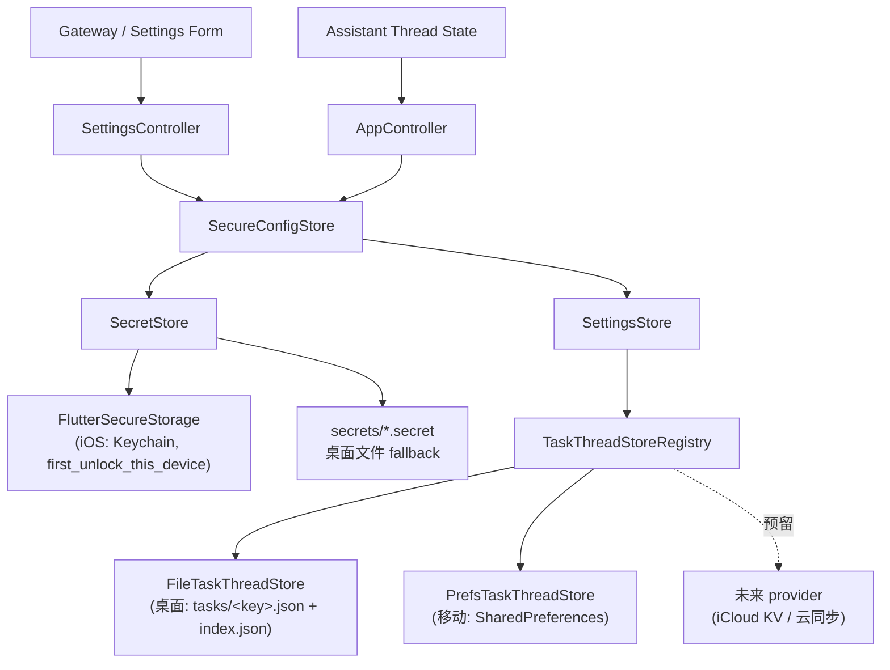

# Secure Local Persistence Architecture

> 2026-07-20 更新:随 `TaskThreadStore` 结构收敛重写(P1)。旧版描述的
> `config-store.sqlite3`、durable mirror 文件与 sealed-state 恢复链路
> 均已从代码中移除,本文只记录当前真实基线。历史方案见 git 历史。

## 目标

本文记录 `XWorkmate.svc.plus` 本地持久化的真实基线,并明确:

- 桌面端与移动端各自的真值源与文件/键布局
- secret 与 recoverable local state 的边界
- 存储后端的扩展方式(provider 插件位)与容量演进(P2)预留

如果写路径发生变化,本文必须和 `SettingsStore` / `TaskThreadStore`
实现、测试断言一起更新。

## 分层结构(P1 收敛后)

- `SettingsStore` 不再包含任务线程的平台分支;它通过
  `TaskThreadStoreRegistry.resolveForPlatform()` 拿到当前平台的
  `TaskThreadStore` 实现,只面向接口读写。
- 新的存储后端(例如 iCloud key-value store、CloudKit、其他云同步)
  实现 `TaskThreadStoreProvider` 并注册进 registry 即可接入,
  `SettingsStore` 与上层不感知。
- 设置快照与审计 trail 仍由 `SettingsStore` 直接按平台落盘
  (移动 prefs / 桌面文件),后续如需同样收敛可复用相同 provider 模式。

## 当前真值源

### 桌面(macOS / Linux / Windows)

根目录:macOS 为 `~/Library/Application Support/xworkmate`,其余平台
按惯例解析(见 `file_store_support.dart`)。

- `config/settings.yaml` — `SettingsSnapshot`
- `config/audit.json` — secret 操作审计(最多 40 条)
- `tasks/index.json` — `{ "version": 1, "threadIds": [有序] }`
- `tasks/<base64url(threadId)>.json` — 每会话一个 `TaskThread`
- `tasks/*.invalid-<ts>.bak` — 损坏记录的原字节隔离备份(只写不读)
- `secrets/*.secret` — `SecretStore` 的文件型 secure-storage fallback

写入语义(`FileTaskThreadStore`):

- save 按上次写入缓存做 diff,只重写脏会话(O(dirty) 非 O(history)),
  index 仅在成员或顺序变化时重写;全部经 `atomicWriteString`。
- 坏一个文件只丢一个会话:原字节备份为 `.invalid-<ts>.bak`、上报
  skip 记录、把源文件移出工作集,避免每次启动重复失败。
- index 与会话文件之间被杀留下的孤儿文件,load 时按 threadId 排序
  追加恢复,不丢弃。

### 移动(iOS / Android)

真值源是 `SharedPreferences`(iOS `UserDefaults` / Android 等价物),
`PrefsTaskThreadStore`:

- `xworkmate.tasks.index` — 与桌面同构的有序索引 JSON
- `xworkmate.tasks.thread.<threadId>` — 每会话一个 JSON 字符串
- `xworkmate.tasks.invalid.<threadId>-<ts>` — 损坏值的原文备份(只写不读)
- `xworkmate.storage.schemaVersion` — 未来 schema 迁移的锚点(当前 = 1,
  只打标不迁移)
- `xworkmate.settings.yaml` / `xworkmate.audit.json` — 设置快照与审计

选型依据(iOS):

- 值由系统守护进程(cfprefsd)落盘,App 被杀不影响已写入的值 —
  比进程内文件写更抗「后台被杀」。
- 免疫容器 UUID 漂移(升级/重装后绝对路径悬空的历史根因)。
- 卸载即清空 UserDefaults 而 Keychain 残留,与 `keychain_bound_uuid`
  绑定检查组合出「重装即登出」语义。
- 会话历史随 iCloud 设备备份;制品工作区 `Documents/.xworkmate`
  已被 `isExcludedFromBackup` 排除(App Review 2.23)。

**没有回退与迁移**:移动端不读沙盒文件,也不迁移任何旧布局
(2026-07-20 决策:不向后兼容,旧版沙盒数据视为不存在)。
「prefs 为空」就是合法的空状态,不触发任何数据回捞——这从结构上
杜绝了「删除全部会话/清理本地状态后旧数据复活」一类缺陷。

## Trust Boundary

### 1. 高敏感 secret(走 `SecretStore`)

Gateway token/password、AI Gateway API key、Vault token、
device token / device identity 私钥材料。

- iOS 主路径 Keychain(`first_unlock_this_device`,不进 iCloud
  Keychain 同步);桌面为 secure storage,不可用时降级文件 fallback。
- 启动时 `keychain_bound_uuid` 缺失 → 判定全新安装或重装 →
  `deleteAll()` 清残留凭据后重新绑定(重装即登出)。

### 2. 可恢复的本地应用状态(走 `SettingsStore` / `TaskThreadStore`)

`SettingsSnapshot`、`TaskThread` 列表(含会话消息)、审计 trail。
明文 JSON,属 recoverable app state,不是 secret store。

## Clear 行为

`clearAssistantLocalState()`:

- 任务线程:`TaskThreadStore.clear()` — 桌面删 index 与全部会话文件;
  移动删所有 `xworkmate.tasks.*` 键(含 invalid 备份)。
- 设置快照:移动删 prefs 键;桌面删 `config/settings.yaml`。
- 不触碰任何 secret(Gateway token/password、API key、device token)。

## P2 预留:容量演进

`SharedPreferences` 是单 plist:全量驻内存、每次修改整体重序列化,
而消息历史无界增长。P1 已把演进面收敛为「新增一个 provider」:

- 触发条件:先对 plist 实际尺寸埋点;超过约 1–2 MB 或启动加载可感知
  变慢时启动 P2。
- 方向:线程元数据 + index 留 prefs;消息体按会话拆分(App Support
  原子写文件,相对路径寻址),或引入 sqflite/drift(WAL)作为新
  provider。两者都不需要改动 `SettingsStore` 之上的任何代码。

## Debug / Test 策略

- `SettingsStore` 支持注入 `TaskThreadStore` / registry,存储实现可以
  脱离平台分支被直接单测(见 `test/runtime/task_thread_store_test.dart`)。
- `SecretStore` 保留可注入的 secure storage client
  (`Memory` / `File` / `Keychain`)。

## 当前文档结论

- secrets 走 `SecretStore`(Keychain / 文件 fallback)。
- 任务线程走 `TaskThreadStore` provider:桌面文件布局、移动
  SharedPreferences,二者行为契约一致(索引排序、孤儿恢复、
  逐条容错 + 隔离备份、O(dirty) 写)。
- 不存在 SQLite、durable mirror、sealed-state 或任何 legacy
  迁移/回退路径;旧数据不被读取。
