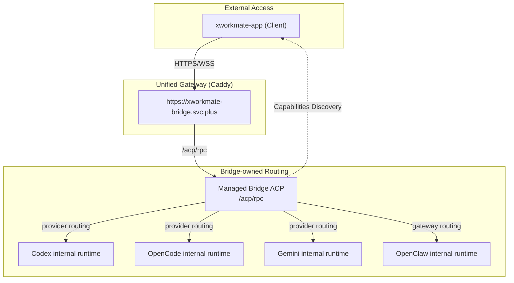

# xworkmate-bridge 统一路由架构文档

## 1. 架构概览 (Unified Routing Architecture)

当前系统采用 `xworkmate-bridge.svc.plus` 作为统一入口。App 侧通过 managed bridge ACP 主入口 `/acp/rpc` 处理能力发现、路由解析、agent / multi-agent 任务、OpenClaw gateway 任务和会话控制。Provider runtime 与 gateway runtime 地址仍由 bridge 后端内部拥有，不暴露为 App-facing public mapping。

## 2. 路由分发规则

| Bridge-owned mapping | App 侧行为 | 备注 |
| :--- | :--- | :--- |
| `/acp/rpc` | 直接调用 | 能力发现、路由解析、agent / multi-agent 任务、OpenClaw gateway 任务、cancel、close |
| provider runtime | 不直连 | Bridge 后端内部解析 provider |
| gateway runtime | 不直连 | Bridge 后端内部解析 gateway provider |

## 3. 运维配置优化

### 3.1 统一鉴权
App 发往 `xworkmate-bridge.svc.plus/acp/rpc` 的请求必须携带：
- **Header**: `Authorization: Bearer <bridge-auth-token>`
- **未授权响应**: `401 Unauthorized`

### 3.2 SSE / WebSocket 优化
所有反向代理均配置了 `flush_interval -1`，禁用了响应缓冲，以支持低延迟的 SSE 流式输出和稳定的 WebSocket 长连接。

### 3.3 日志持久化 (Docker)
`xworkmate-bridge-managed` 容器已配置日志挂载：
- **宿主机路径**: `/var/log/xworkmate-bridge/`
- **容器路径**: `/app/logs`
- **轮转策略**: 单文件 50MB，保留最近 3 个文件。

## 4. App 侧不变量

- App 不写入或拼接本地 provider endpoint。
- App 不直接调用 `/acp-server/*`。
- App 不调用 `/gateway/openclaw`；OpenClaw `session.start` / `session.message` task submit 通过 `/acp/rpc` 的 routing metadata 表达。
- `acp.capabilities` 是 provider catalog、gateway catalog、available execution targets 的唯一来源。
