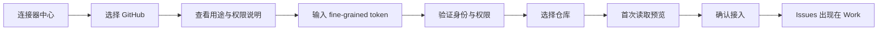

# GitHub Issues 只读连接器详细设计

> 状态：待评审
> 优先级：第一批 Connector / C1
> 首期能力：连接 GitHub，选择仓库，读取 Issues，并在 Work 中以只读工作项展示。

## 1. 目标

用户可以在 XWorkmate 的连接器中心连接 GitHub，选择有权限访问的仓库，并将 GitHub Issues 读取到工作台中，用于：

- 查看待处理 Issue。
- 按仓库、状态、标签、负责人和里程碑筛选。
- 将 Issue 归入个人专项视图。
- 由 AI 汇总进度、风险和待办。
- 从 XWorkmate 回跳 GitHub 查看原始 Issue。

首期验证的是完整 Connector 闭环，而不是 GitHub 全功能客户端。

## 2. 首期范围

### 2.1 包含

- 连接器中心展示 GitHub。
- 使用 GitHub fine-grained personal access token 连接。
- 验证当前凭据。
- 列出授权范围内的仓库。
- 用户显式选择需要读取的仓库。
- 读取开放和已关闭 Issues。
- 排除 REST Issues 响应中的 Pull Requests。
- 支持分页和增量刷新。
- 映射为只读 `ExternalWorkItem`。
- 展示连接状态、最近同步和错误。
- 安全保存令牌。
- 断开连接并清理令牌、游标和本地索引。

### 2.2 不包含

- 创建、编辑、关闭或重新打开 Issue。
- 添加评论、标签、负责人或里程碑。
- Pull Request、代码、CI 和 Release 数据。
- Webhook 实时推送。
- GitHub Enterprise Server。
- 多 GitHub 账号。
- 后台定时同步。

## 3. 参考与约束

GitHub 官方 REST API 支持按仓库读取 Issue；其 Issue 列表可能同时包含 Pull Request，因此客户端必须过滤带 `pull_request` 字段的条目。[GitHub Issues REST API](https://docs.github.com/en/rest/issues/issues)

首期使用 fine-grained token，并将仓库范围限制为用户明确选择的仓库。只申请读取 Issues 和读取仓库元数据所需的最小权限。[GitHub fine-grained token 权限](https://docs.github.com/en/rest/authentication/permissions-required-for-fine-grained-personal-access-tokens)

## 4. 用户流程



失败分支：

- Token 无效：不保存，显示重新输入。
- Token 有效但无仓库权限：显示缺失权限，不进入已连接状态。
- 部分仓库不可访问：只接入验证成功的仓库，并列出失败项。
- API 限流：保留上次成功数据，显示下次可重试时间。

## 5. 页面设计

### 5.1 连接器列表

未连接：

```text
[GitHub 图标] GitHub
读取仓库 Issues，在工作台统一查看和 AI 整理
                                               [连接]
```

已连接：

```text
[GitHub 图标] GitHub
账号 topo · 3 个仓库 · 2 分钟前同步
                                      [● 已就绪] [>]
```

### 5.2 连接详情

- 账号。
- GitHub API 地址，首期固定 `https://api.github.com`。
- 已选仓库。
- 权限：只读 Issues。
- 同步模式：手工刷新。
- 最近成功时间。
- 最近错误与重试。
- 断开连接。

### 5.3 Issue 列表

每项显示：

- 仓库与 Issue 编号。
- 标题。
- open / closed。
- 标签。
- 负责人。
- 里程碑。
- 评论数。
- 最近更新时间。
- 外部链接。
- 数据来源和最近同步状态。

## 6. 领域模型

```text
ConnectorAccount
├── connectorId = github
├── accountId
├── displayName
├── status
└── credentialRef

ConnectorScope
├── externalId = owner/repository
├── displayName
├── enabled
├── syncCursor
└── lastSyncedAt

ExternalWorkItem
├── source = github
├── externalId = repository#number
├── externalUrl
├── projectRef = owner/repository
├── title
├── description
├── status
├── priority
├── assignees
├── labels
├── milestone
├── createdAt
├── updatedAt
└── sourceVersion
```

### 6.1 字段映射

| GitHub Issue | XWorkmate |
| --- | --- |
| `repository.full_name` | `projectRef` |
| `number` | `externalSequence` |
| `title` | `title` |
| `body` | `description` |
| `state` | `status` |
| `labels[]` | `tags[]` |
| `assignees[]` | `assignees[]` |
| `milestone` | `milestone` |
| `html_url` | `externalUrl` |
| `created_at` | `createdAt` |
| `updated_at` | `updatedAt` / `sourceVersion` |

GitHub 没有统一的进度与优先级语义。首期不猜测：

- `progress` 留空。
- `priority` 只有在用户配置了标签映射时才生成。
- Work 视图可以基于标签和状态做 AI 分析，但不写回 GitHub。

## 7. 组件边界

### 7.1 APP

- 连接器列表与详情页。
- Token 输入与安全存储引用。
- 仓库选择、首次读取预览。
- Issue 只读列表与 Work 映射展示。
- 用户触发刷新、断开和错误恢复。

### 7.2 XStream

- `GitHubConnectorProvider`。
- GitHub REST 请求、分页、限流和响应标准化。
- 令牌只在执行时从安全引用解析。
- 返回统一 `ExternalWorkItemPage`。

### 7.3 Infra

- 可选的服务端 Provider 运行环境。
- 出站网络策略。
- 调用指标、限流和成本记录。
- 不记录 Authorization Header 或 Issue 私密正文。

## 8. Provider 接口

```text
GitHubConnectorProvider
├── validateCredential(credentialRef) -> AccountSummary
├── listRepositories(accountId, cursor) -> RepositoryPage
├── previewIssues(repositoryIds, limit) -> ExternalWorkItemPage
├── pullIssues(repositoryId, cursor) -> ExternalWorkItemPage
├── getRateLimit() -> RateLimitState
└── disconnect(accountId)
```

统一响应：

```json
{
  "items": [],
  "nextCursor": null,
  "sourceRevision": "2026-07-28T08:30:00Z",
  "rateLimit": {
    "remaining": 4500,
    "resetAt": "2026-07-28T09:00:00Z"
  }
}
```

## 9. 安全设计

- Token 只存安全存储，普通设置仅保存 `credentialRef`。
- 令牌输入框保存后不回填明文。
- 日志、错误、审计和截图不得包含令牌。
- 远程请求必须使用 HTTPS，不允许降级。
- 用户明确选择仓库，禁止默认读取账号下全部仓库。
- 首期只读，不申请写权限。
- 断开连接时删除安全存储中的凭据和本地同步游标。
- 私有 Issue 正文默认不进入长期学习；用户主动总结时才作为临时上下文。

## 10. 同步与缓存

首期采用“连接时首次读取 + 用户手工刷新”：

1. 每页最多 50 条。
2. 按 `updated_at desc` 获取。
3. 保存每仓库最后成功更新时间和分页游标。
4. 刷新时获取自该时间之后发生变化的 Issue。
5. 同一个 `repository#number` 只保留最新版本。
6. 刷新失败不清空上次成功数据。
7. 删除或不可见的 Issue 标记为 `sourceUnavailable`，不立即物理删除。

## 11. 错误模型

| 错误 | 产品表现 |
| --- | --- |
| 401 | 凭据失效，需要重新连接 |
| 403 权限不足 | 显示缺少 Issues read 或仓库授权 |
| 403 限流 | 显示重置时间，保留缓存 |
| 404 | 仓库不可访问或已删除 |
| 422 | 请求参数或游标失效，重新全量读取当前仓库 |
| 网络超时 | 可重试，不改变连接状态 |
| JSON Schema 异常 | 标记 Provider 响应错误并记录脱敏诊断 |

## 12. 测试矩阵

### 单元测试

- `owner/repo` 和 GitHub URL 解析。
- Issue 字段映射。
- Pull Request 过滤。
- 分页游标。
- 限流响应。
- 错误信息不包含 Token。

### Widget 测试

- 未连接、连接中、已就绪、需处理、错误状态。
- Token 输入使用密码样式。
- 连接失败不保存 Token。
- 仓库选择和首次预览。
- Issue 列表和空状态。

### 集成测试

- 使用测试账号和只读仓库完成真实连接。
- 私有仓库权限不足。
- 多仓库选择。
- 断开后无法继续读取。
- 重启 APP 后可以从安全存储恢复连接，但不显示 Token。

## 13. 实施任务

1. 定义 Connector 通用状态、账号、Scope 和分页模型。
2. 定义 XStream `GitHubConnectorProvider` 协议。
3. 完成安全凭据引用。
4. 完成账号验证和仓库列表。
5. 完成 Issues 读取、分页和 PR 过滤。
6. 完成 Connector 列表、详情与仓库选择。
7. 完成 Work 只读映射。
8. 完成缓存、刷新和断开。
9. 完成安全、Widget、集成和回归测试。

## 14. 验收标准

- 用户能连接一个 GitHub 账号并选择至少一个仓库。
- APP 只申请读取所选仓库 Issues 所需权限。
- 能读取开放和关闭 Issue，且不会把 PR 当作 Issue。
- Issue 在 Work 中明确标记为 GitHub 只读来源。
- Token 不出现在普通设置、日志、截图、测试产物和 Artifact 中。
- 失败刷新不会清空上次成功数据。
- 用户可以断开连接并清理凭据。
