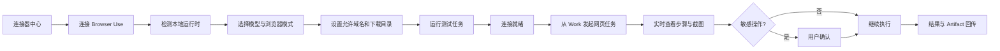
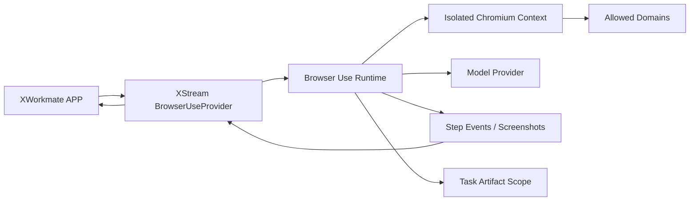

# 开源 Browser Use 连接器详细设计

> 状态：待评审
> 优先级：第一批 Connector / C2
> 推荐首个 Provider：[browser-use/browser-use](https://github.com/browser-use/browser-use)
> 目标：让 AI Workspace 可以通过开源 Provider 执行受控浏览器任务，并将过程、证据和结果回传到当前 Work。

## 1. 产品定位

Browser Use 不是普通网页搜索，也不是浏览器书签。它是一个可执行 Connector：

- 打开网页。
- 读取和提取结构化内容。
- 在限定网站内导航。
- 填写表单。
- 执行可确认的点击、提交和下载。
- 保存截图、日志和生成文件。

`browser-use/browser-use` 提供开源 Python Agent，可自选模型、定制工具和嵌入产品；官方同时提供云服务，但本设计默认优先开源、本地或自托管模式。该项目当前以 MIT License 发布，并明确支持作为库嵌入产品。[Browser Use 官方仓库](https://github.com/browser-use/browser-use)

## 2. 首期范围

### 2.1 包含

- 连接器中心展示 Browser Use。
- 检测本地 Provider 是否安装和可运行。
- 配置模型来源，不把 Provider 绑定到固定模型。
- 启动独立浏览器上下文。
- 打开 URL、导航、读取、提取和截图。
- 限制允许访问的域名。
- 下载文件到当前 Task Artifact Scope。
- 表单填写，但提交前必须确认。
- 逐步事件、截图和最终结果回传。
- 用户随时停止任务。

### 2.2 不包含

- 默认接管用户日常 Chrome Profile。
- 绕过验证码、反自动化或网站访问控制。
- 未经确认购买、支付、发布、发送或删除。
- 保存明文网站密码。
- 隐藏浏览器执行。
- 无界后台爬取。
- Browser Use Cloud 的专有能力。

## 3. Provider 选择

### 3.1 首选

`browser-use/browser-use`：

- 开源 MIT。
- Python Library 适合嵌入和自托管。
- 支持不同 LLM。
- 支持自定义 Tools。
- 支持结构化输出。
- 支持域名限制和真实浏览器 Profile，但首期不启用用户 Profile。

### 3.2 备用

- Playwright Provider：适合确定性脚本、测试和无需 Agent 推理的流程。
- Agent TARS Browser Operator：适合 DOM + GUI 混合模式。
- 未来其他 Browser Agent：只要实现统一 `BrowserUseProvider`。

## 4. 用户流程



## 5. 连接器中心

列表项：

```text
[Browser Use 图标] Browser Use
开源浏览器自动化 · 本地运行 · 独立会话
                                    [● 已就绪] [>]
```

详情页：

- Provider 版本。
- 运行位置：本机 / XWorkspace / 远程沙箱。
- 模型和模型来源。
- 浏览器：Chromium，首期固定。
- 会话模式：临时独立 Profile。
- 允许域名。
- 下载权限。
- 截图保留期限。
- 最近测试。
- 重新检测、暂停和断开。

## 6. 任务权限模型

| 权限 | 默认 | 说明 |
| --- | --- | --- |
| 打开用户提供的 URL | 允许 | 仍需经过域名策略 |
| 页面读取和截图 | 允许 | 截图可能包含敏感信息 |
| 页面导航 | 允许 | 限定允许域名 |
| 输入普通文本 | 允许 | 密码字段另行处理 |
| 文件上传 | 每次确认 | 只允许用户显式选择的文件 |
| 文件下载 | 允许到任务目录 | 禁止任意路径 |
| 提交表单 | 每次确认 | 包含注册、发布、发送 |
| 登录 | 每次确认 | 不记录密码 |
| 购买和支付 | 禁止 | 后续单独设计 |
| 删除或注销 | 禁止 | 后续单独设计 |

## 7. 运行架构



### 7.1 APP

- 连接、权限、域名和运行位置配置。
- 任务预览、敏感动作确认和紧急停止。
- 实时步骤、截图和 Artifact 展示。

### 7.2 XStream

- Provider 发现与健康检查。
- 启动、观察、批准、取消。
- 统一事件流和错误模型。
- 传递 Task Artifact Scope。

### 7.3 Provider

- 浏览器生命周期。
- Agent 推理与 DOM/视觉动作。
- 域名策略强制执行。
- 下载和截图输出。
- 浏览器进程清理。

## 8. 统一接口

```text
BrowserUseProvider
├── probe() -> ProviderCapabilities
├── createSession(policy) -> BrowserSession
├── startTask(sessionId, task, artifactScope) -> RunHandle
├── streamEvents(runId) -> BrowserEventStream
├── approve(runId, approvalId, decision)
├── cancel(runId)
└── closeSession(sessionId)
```

事件：

```text
session.started
page.opened
step.started
step.observed
action.proposed
approval.required
action.completed
artifact.created
task.completed
task.failed
session.closed
```

## 9. 策略模型

```json
{
  "allowedDomains": ["github.com", "*.github.com"],
  "blockedDomains": [],
  "allowDownloads": true,
  "allowUploads": false,
  "requireApprovalFor": [
    "submit_form",
    "login",
    "upload_file",
    "send_message"
  ],
  "maxSteps": 50,
  "maxDurationSeconds": 900,
  "artifactScope": "tasks/session/run"
}
```

Provider 必须强制执行策略，不能只依赖模型遵守提示。

## 10. 数据与 Artifact

任务输出至少包含：

- `result.md`：结果摘要与来源 URL。
- `events.jsonl`：脱敏后的步骤事件。
- `screenshots/`：用户允许保留的关键截图。
- 下载文件：直接进入当前 Task Artifact Scope。
- `manifest.json`：文件、来源、时间和校验值。

不得输出：

- Cookie。
- Authorization Header。
- 密码字段。
- 完整浏览器 Profile。
- 未经授权的网页存储。

## 11. 安全设计

- 默认使用临时独立 Profile。
- 真实 Profile 接入作为后续独立高风险能力。
- 凭据由用户在浏览器内输入，不进入模型上下文或日志。
- 文件上传必须由用户明确选择。
- 下载只能进入任务目录。
- 域名 Allowlist 在网络请求和页面跳转两层校验。
- 禁止 Provider 修改本地任意文件。
- 敏感操作通过结构化 `approval.required` 事件暂停。
- APP 和 Provider 均提供停止按钮；Provider 超时后必须结束浏览器进程。
- 默认关闭开源项目可能存在的遥测，或在连接详情中明确披露。

## 12. 失败恢复

| 情况 | 处理 |
| --- | --- |
| Provider 未安装 | 显示安装说明，不进入 Ready |
| 浏览器启动失败 | 清理残留进程并重试一次 |
| 页面加载超时 | 保留截图和当前 URL，允许继续或停止 |
| 跳转到未授权域名 | 阻止并要求用户扩展 Allowlist |
| 验证码 | 暂停并交给用户，不尝试绕过 |
| Approval 超时 | 保持暂停，超时后安全终止 |
| APP 断开 | Provider 自动暂停高风险动作 |
| Provider 崩溃 | 标记失败并保留现有 Artifact |

## 13. 测试矩阵

### Provider 合同测试

- Probe 与版本。
- 独立 Profile。
- 域名 Allowlist。
- 事件顺序。
- Approval 暂停与恢复。
- Cancel 和超时。
- Artifact 路径约束。

### 端到端场景

- 打开公开网页并总结。
- 从多页列表提取结构化数据。
- 填写但不提交表单。
- 提交前出现确认。
- 下载文件进入任务目录。
- 遇到未授权域名时停止。
- 任务完成后无残留浏览器进程。

### 安全测试

- 日志不含 Cookie、Token、密码。
- 上传不能读取未选择文件。
- 下载不能逃逸 Artifact Scope。
- 取消后不继续操作。

## 14. 实施阶段

### B0：Provider 探测

- Provider 接口。
- 本地安装和版本检测。
- 连接器中心状态。

### B1：只读浏览

- 打开、导航、读取、截图、总结。
- 域名 Allowlist。
- 事件流和取消。

### B2：受控交互

- 点击、输入、下载。
- Approval。
- Artifact 合同。

### B3：高级会话

- 用户明确授权的持久 Profile。
- 计划任务和远程沙箱。
- 多会话资源控制。

## 15. 验收标准

- 可以使用开源 Browser Use Provider 完成公开网页只读任务。
- 浏览器运行在独立会话中。
- 用户能实时看到关键步骤并随时停止。
- 未授权域名不会被访问。
- 提交、上传和登录前会暂停确认。
- 下载和截图只进入当前 Task Artifact Scope。
- Provider 可替换，不把 APP 绑定到 Browser Use 私有 API。
