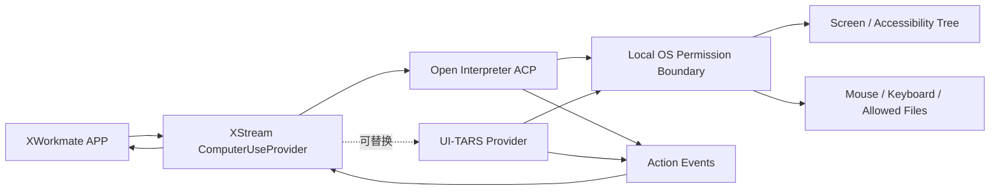

# 开源本地 Computer Use 连接器详细设计

> 状态：待评审
> 优先级：第一批 Connector / C3-C4
> 首期推荐 Provider：Open Interpreter ACP
> 备用视觉 GUI Provider：UI-TARS Desktop
> 目标：在用户明确授权和可观察的前提下，让 AI 操作本地电脑完成跨应用任务。

## 1. 产品定位

Local Computer Use 是最高风险的 Connector。它可以观察真实屏幕，并可能操作键盘、鼠标、应用、文件和系统对话框。

它必须满足：

- 用户看得见。
- 每个权限可解释。
- 高风险动作前暂停。
- 随时可以停止。
- 所有动作可审计。
- Provider 可替换。
- 默认最小权限。

Open Interpreter 当前提供 ACP 兼容运行方式，并支持 macOS、Linux、Windows 的原生沙箱、权限和 Computer Use；这与 XWorkmate → XStream → ACP 的现有执行路径较匹配。[Open Interpreter 官方仓库](https://github.com/openinterpreter/openinterpreter)

UI-TARS Desktop 提供本地和远程 Computer/Browser Operator，可作为视觉 GUI Provider 的候选实现。[UI-TARS Desktop 官方仓库](https://github.com/bytedance/UI-TARS-desktop)

## 2. Provider 策略

### 2.1 首期推荐：Open Interpreter ACP

原因：

- ACP 兼容，减少新协议。
- Apache-2.0。
- 本地运行。
- 支持多个模型 Provider。
- 支持原生沙箱、权限、Skills 和 MCP。
- 更适合先接入观察、任务事件和审批。

### 2.2 备用：UI-TARS Desktop

适合：

- 以截图和视觉模型驱动 GUI。
- 复杂桌面界面。
- 本地或远程 Operator。

接入前需要专项评估：

- Provider API 稳定性。
- 模型部署和资源消耗。
- macOS 辅助功能、屏幕录制权限。
- 许可证与分发边界。
- 是否能提供可暂停、可审计的结构化动作事件。

### 2.3 统一要求

APP 不直接调用 Open Interpreter 或 UI-TARS 私有接口，而是面向 `ComputerUseProvider`。

## 3. 分阶段范围

### 3.1 C3：观察模式

- 检测 Provider。
- 用户选择允许观察的显示器或窗口。
- 屏幕截图。
- 读取可访问性树或 UI 元素摘要。
- 生成操作计划。
- 不点击、不输入、不运行命令。
- 用户确认计划。

### 3.2 C4：受控操作模式

- 鼠标移动和点击。
- 键盘输入。
- 打开用户允许的应用。
- 在授权工作目录内读取和写入。
- 高风险动作前确认。
- 全程事件和关键截图。
- 紧急停止。

### 3.3 首期不包含

- 后台无人值守执行。
- 登录系统设置、钥匙串或密码管理器。
- 安装软件、修改系统安全设置。
- 提权和管理员操作。
- 删除用户文件。
- 支付、转账和购买。
- 发送邮件、消息或发布内容。
- 摄像头和麦克风访问。
- 绕过 OS 权限提示。

## 4. 用户流程


## 5. 连接器详情

- Provider：Open Interpreter / UI-TARS / 其他。
- 版本和运行位置。
- 模型和模型运行位置。
- OS 权限：
  - 屏幕录制。
  - 辅助功能。
  - 自动化。
  - 允许访问的目录。
- 允许应用列表。
- 默认模式：观察。
- 高风险动作策略。
- 最近任务和最近错误。
- 紧急停止快捷键。
- 暂停和断开。

## 6. 权限模型

### 6.1 能力分级

| 等级 | 能力 | 默认 |
| --- | --- | --- |
| L0 | 获取系统和 Provider 状态 | 允许 |
| L1 | 查看用户选择的窗口截图 | 每次会话允许 |
| L2 | 读取 UI 结构和生成计划 | 每次会话允许 |
| L3 | 鼠标移动、普通点击、非敏感输入 | 计划确认后允许 |
| L4 | 文件读写、打开应用、提交表单 | 每个动作确认 |
| L5 | 删除、发送、发布、购买、系统设置 | 首期禁止 |

### 6.2 作用域

```json
{
  "displayIds": ["main"],
  "windowIds": ["selected-window"],
  "allowedApplications": ["Finder", "Preview", "Microsoft Excel"],
  "workspaceDirectories": ["/user-selected/workspace"],
  "allowClipboardRead": false,
  "allowClipboardWrite": true,
  "allowShell": false,
  "maxDurationSeconds": 600,
  "maxActions": 100
}
```

权限不能只写入 Prompt，必须由 APP、XStream 和 Provider 的执行层共同强制。

## 7. 运行架构



### 7.1 APP

- 权限说明和 OS 权限状态。
- 窗口、应用和目录选择。
- 计划预览。
- Approval、暂停和紧急停止。
- 实时动作和截图。

### 7.2 XStream

- ACP 或 Provider 进程管理。
- Provider 发现和能力协商。
- 统一动作、审批和审计事件。
- Session 与 TaskThread 绑定。
- 中断和恢复。

### 7.3 Provider

- 屏幕与可访问性观察。
- 动作规划或执行。
- OS 权限和作用域二次校验。
- 动作前后截图。
- Artifact 输出。

## 8. Provider 接口

```text
ComputerUseProvider
├── probe() -> ProviderCapabilities
├── inspectPermissions() -> PermissionState
├── createSession(scope, mode) -> ComputerSession
├── observe(sessionId) -> Observation
├── proposePlan(sessionId, task) -> ActionPlan
├── executePlan(sessionId, approvedPlan) -> RunHandle
├── streamEvents(runId) -> ComputerEventStream
├── approve(runId, approvalId, decision)
├── pause(runId)
├── resume(runId)
├── emergencyStop(runId)
└── closeSession(sessionId)
```

关键事件：

```text
observation.captured
plan.proposed
plan.approved
action.proposed
approval.required
action.started
action.completed
action.rejected
scope.violation
artifact.created
run.paused
run.stopped
run.completed
run.failed
```

## 9. 动作模型

所有动作必须结构化，禁止只传不可审计的自然语言：

```json
{
  "actionId": "action-12",
  "type": "click",
  "target": {
    "application": "Microsoft Excel",
    "windowId": "window-3",
    "accessibilityId": "save-button"
  },
  "reason": "保存用户已确认的工作表",
  "risk": "medium",
  "requiresApproval": true,
  "expectedEffect": "打开保存对话框"
}
```

坐标点击只作为没有稳定 UI 元素标识时的退化方案，并记录动作前后截图。

## 10. 审批与紧急停止

### 10.1 审批

必须确认：

- 第一次控制新应用。
- 写入或覆盖文件。
- 上传文件。
- 提交表单。
- 访问不在初始计划中的窗口。
- 使用剪贴板敏感内容。

首期禁止：

- 删除文件。
- 发送、发布、支付。
- 修改安全设置。
- 输入系统密码。

### 10.2 紧急停止

- APP 内固定停止按钮。
- 全局键盘快捷键。
- Provider 进程级终止。
- 停止后释放键鼠控制。
- 关闭任务 Session。
- 保留已产生的脱敏审计和 Artifact。

即使 APP UI 卡死，XStream 也必须能通过独立控制通道终止 Provider。

## 11. 数据与隐私

### 11.1 默认不持久化

- 连续屏幕视频。
- 完整桌面截图序列。
- 剪贴板内容。
- 密码字段。
- 系统通知内容。
- 非目标应用窗口。

### 11.2 可以持久化

- 用户确认保留的关键截图。
- 结构化动作事件。
- 最终文件。
- 错误截图。
- Provider、模型、时间和作用域元数据。

### 11.3 学习边界

- Computer Use 记录默认不进入 Learning Loop。
- 用户明确选择“从本次流程学习”后，只提取结构化步骤。
- 截图、密码、剪贴板和私密文件内容不得写入长期学习。
- 生成 Skill 前必须再次审核作用域和敏感信息。

## 12. 平台权限

### macOS

- 屏幕录制。
- 辅助功能。
- 必要时的 Apple Events 自动化。
- 用户选择的文件与目录。

### Windows

- UI Automation。
- 屏幕捕获。
- 普通用户会话权限。
- 禁止自动触发 UAC 提权。

### Linux

- Wayland/X11 能力检测。
- 优先独立虚拟桌面或 KasmVNC 环境。
- 真实桌面控制需要显式选择和安全说明。

新增原生 Entitlement 或打包权限前必须单独评审，不在 Connector 安装时静默增加。

## 13. 失败与恢复

| 情况 | 处理 |
| --- | --- |
| OS 权限未授权 | 保持未就绪，提供系统设置指引 |
| 窗口消失 | 暂停并请求重新选择 |
| UI 元素找不到 | 重新观察，不盲目连续点击 |
| APP 断开 | Provider 自动暂停 |
| Provider 无响应 | XStream 超时终止 |
| 作用域违规 | 阻止动作、暂停任务、通知用户 |
| 模型输出无效动作 | 拒绝并重新规划 |
| 紧急停止 | 立即释放输入并终止 Session |

## 14. 测试矩阵

### 合同测试

- Provider 探测和能力协商。
- 权限状态。
- 观察、计划、执行的状态机。
- Approval。
- Pause / Resume / Emergency Stop。
- Scope enforcement。

### 安全测试

- 未授权窗口不可截图。
- 未授权目录不可读写。
- 密码字段不进入事件。
- APP 断开后无继续操作。
- 紧急停止可以独立生效。
- Provider 日志不包含屏幕原文和凭据。

### 端到端场景

- 观察一个测试窗口并生成计划。
- 在测试应用中点击非敏感按钮。
- 向测试表单输入普通文本但不提交。
- 保存文件前暂停确认。
- 尝试访问未授权应用时被阻止。
- 紧急停止后没有后续键鼠事件。

真实测试使用专用测试账号、测试应用和临时目录，不在开发者日常桌面执行破坏性场景。

## 15. 实施阶段

### C0：Provider 评估

- Open Interpreter ACP PoC。
- UI-TARS Provider 能力和许可证评估。
- 统一协议定稿。

### C1：观察模式

- Provider 探测。
- OS 权限。
- 窗口选择。
- 截图、UI 摘要和计划。

### C2：测试环境受控操作

- 测试应用。
- 结构化动作。
- Approval、暂停和停止。

### C3：真实桌面有限开放

- 应用 Allowlist。
- 用户选择目录。
- 错误恢复。
- 审计和 Artifact。

### C4：可复用流程

- 用户主动提取流程。
- Learning Loop 审核。
- Skill 版本和回滚。

## 16. 验收标准

- 未获得 OS 权限时 Provider 不能进入 Ready。
- 默认模式只能观察和生成计划。
- 用户确认计划后才允许执行普通操作。
- 高风险动作逐项确认，禁止项无法绕过。
- 用户可以从 APP 和独立控制通道紧急停止。
- 操作只发生在允许的窗口、应用和目录中。
- 事件与 Artifact 可追溯且不包含密码等敏感数据。
- Open Interpreter 与 UI-TARS 可以通过同一 Provider 协议替换。
