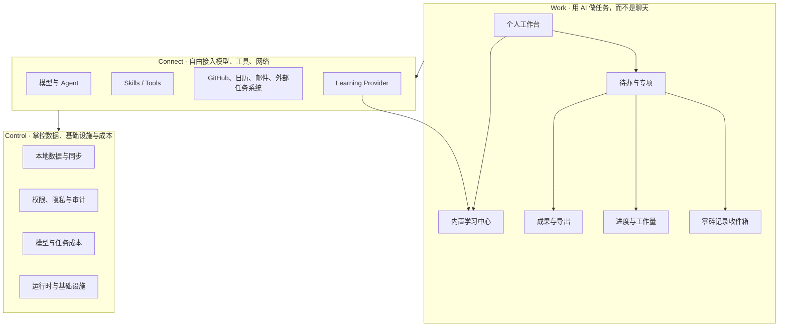
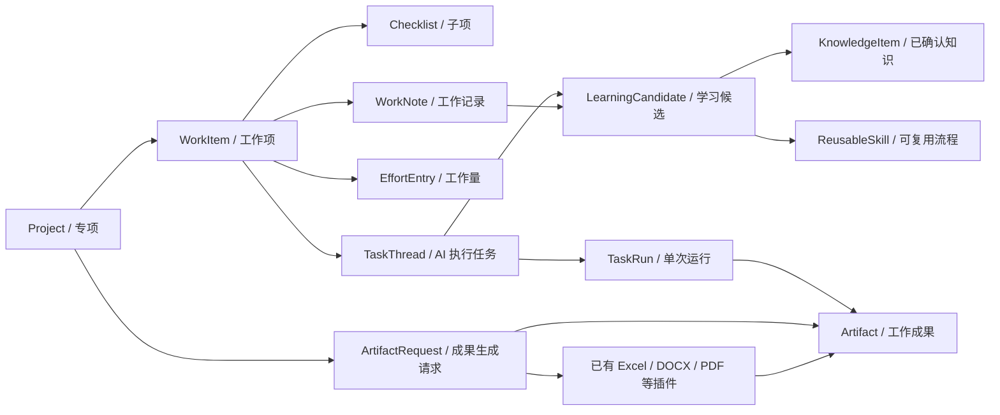
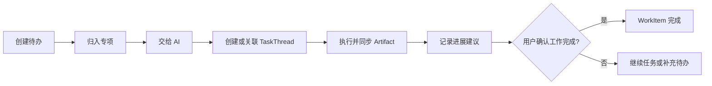
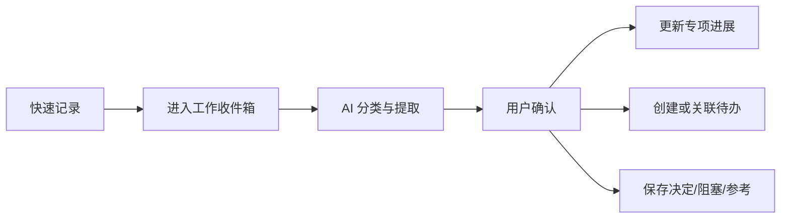
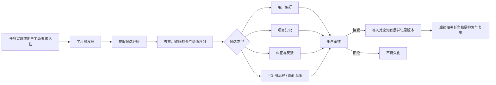

# XWorkmate 个人工作管理与成果导出规划设计

> 状态：总体规划草案
> 日期：2026-07-28
> 面向产品：XWorkmate / AI Workspace
> 核心命题：让用户一目了然地掌握工作进度与工作量，把日常零碎记录沉淀为结构化工作信息，并由 AI 整理、生成符合个人要求的工作成果。

## 1. 背景

AI Workspace 当前的核心主张是：

- **Work**：用 AI 做任务，而不是聊天。
- **Connect**：自由接入模型、工具与网络。
- **Control**：掌控数据、基础设施与成本。

现有 XWorkmate 已经具备 `TaskThread`、任务运行状态、独立工作目录、Artifact 回传与本地同步等基础能力，但用户看到的主要仍是“任务会话”和“单次执行结果”。对于持续性的个人工作管理，还缺少以下产品层能力：

1. 将多个任务归入一个专项、项目或日常工作模块。
2. 区分“任务执行状态”和“真实工作进度”。
3. 随手记录零碎事项，并在之后由 AI 自动分类、提炼和合并。
4. 按日、周、月或专项查看工作量、进度与风险。
5. 将结构化工作数据和任务产物导出成用户指定格式的 Excel 等成果。
6. 从用户确认过的偏好、纠正和成功工作流中持续学习，让工作空间越用越贴合用户。

本设计不把“工作进度”和“待办事项”做成两个相互独立的数据孤岛，而是建立统一的个人工作管理层。

### 1.1 总体产品架构



三层职责：

| 层 | 回答的问题 | 产品职责 |
| --- | --- | --- |
| Work | 我要做什么、做到哪里、形成了什么成果？ | 工作项、专项、进度、工作量、记录、AI 执行、成果和学习 |
| Connect | 由哪个模型、工具或外部系统完成？ | 模型、Agent、Skill、网络、连接器和学习引擎 |
| Control | 数据在哪里、花了多少、是否安全可控？ | 本地优先、同步、权限、审计、成本、运行时和基础设施 |

### 1.2 内置与插件决策总表

| 能力 | 产品决策 | 理由 |
| --- | --- | --- |
| 工作进度 | **内置功能** | 是个人工作空间的核心状态，必须离线可用 |
| 待办事项 | **内置功能** | 是最低门槛的工作入口和统一工作对象 |
| 项目 / 专项 | **内置功能** | 为待办、记录、AI 任务和成果提供归属 |
| 零碎记录收件箱 | **内置功能** | 保证随手记录不依赖模型、网络或外部系统 |
| 工作量管理 | **内置功能** | 必须与进度分开记录并形成稳定事实 |
| AI 整理入口 | **内置功能** | 用户只需表达目标，不需要先寻找插件 |
| Excel 成果生成 | **复用已有 Excel/XLSX 插件** | 不建设独立入口、数据模型或重复 Skill |
| 学习中心 | **内置功能** | 用户必须能查看、审核、修改和删除学习结果 |
| Learning Loop | **官方内置插件 / Provider** | 提取算法需要可替换、可升级、可关闭 |
| Jira / 飞书项目 / Microsoft Project / 外部 Todo | **连接器插件** | 作为正式接入目标，与本地工作模型映射和同步 |
| 数据、成本和运行治理 | **Control 内置能力** | 是 AI Workspace 的信任与自治基础 |

这里的“官方内置插件”表示随产品提供默认实现，但遵循稳定接口，可以禁用或替换；它不等同于不可卸载的核心数据模型。

## 2. 产品目标

### 2.1 用户目标

用户打开 XWorkmate 后，应能快速回答：

- 我现在有哪些工作正在进行？
- 每项工作完成到什么程度？
- 今天、这周投入了多少工作量？
- 哪些事情逾期、受阻或等待他人？
- 最近记录的零碎信息分别属于哪个专项？
- 哪些任务已产生可交付成果？
- 能否按我的模板导出周报、台账、项目进度表或其他 Excel？

### 2.2 产品目标

1. 从“会话列表”升级为“个人工作空间”。
2. 让 AI 任务执行、人工待办管理和工作成果沉淀共用一套结构化数据。
3. 保持 local-first：核心工作数据本地可用、可迁移、可导出。
4. 允许连接外部任务系统，但不让外部平台成为唯一事实来源。
5. 通过已有成果生成插件交付 Excel 等文件，不在工作管理模块重复建设文档引擎。
6. 建立透明、可审查、可撤销的内置学习闭环。

### 2.3 非目标

AI Workspace 不以替代 Jira、飞书项目、Microsoft Project 等团队项目管理平台为目标，而是通过 Connect 层连接这些平台，让用户在自己的工作空间中统一查看、整理和使用 AI。

首期不优先实现：

- 复杂的多人资源排期。
- 财务级工时与成本核算。
- 跨组织审批流。
- 大型项目的关键路径和甘特图计算。
- 完全自动修改用户工作数据而不经过确认。

## 3. 核心产品判断

### 3.1 “工作进度”应是内置功能

工作进度需要读取 XWorkmate 自身的任务状态、工作项、记录、产物与时间数据，是整个工作空间的基础视图，不适合作为可卸载插件。

内置部分包括：

- 工作总览。
- 项目/专项进度。
- 工作量汇总。
- 风险与阻塞提示。
- 待办聚合。
- 工作记录时间线。

插件可以为进度能力提供额外数据源或算法，例如连接 Jira、飞书项目、Microsoft Project、GitHub 和日历，或增加团队视图，但不能替代内置进度模型。

### 3.2 “待办事项”也应是内置功能

待办是用户记录工作意图的最低门槛入口，必须在离线、本地、无外部连接时仍能使用。

内置部分包括：

- 快速新建、完成、延期、归档。
- 优先级、截止日期、预计工作量。
- 归属专项/模块。
- 子项与检查清单。
- 与 XWorkmate `TaskThread` 的关联和启动 AI 执行。

Jira、飞书项目、Microsoft Project、外部 Todo、日历和 Issue 系统适合做连接器插件，由插件负责授权、字段映射和同步。

### 3.3 “AI 整理”是内置交互，具体能力可由 Skill 扩展

“帮我整理这些记录”“生成周报”“按这个模板导出”应是工作管理模块中的原生操作。底层可调用不同模型、Skill 或工具，但用户不应先理解插件概念才能完成工作。

### 3.4 “学习能力”应有内置入口，学习引擎采用插件化架构

学习能力与工作台、任务执行和成果导出都有横向关系，因此用户可见的学习入口、建议确认、知识查看、删除与关闭能力应内置在 APP 中。

具体学习策略和提取器适合插件化。首个官方实现可参考 `hermes-learning-loop`：

- 每完成若干任务或在用户主动触发时进行复盘。
- 从成功任务、错误恢复、用户纠正和重复模式中提取候选经验。
- 区分用户偏好、项目知识、历史事件和可复用流程。
- 候选 Skill 默认先审核，不自动安装或启用。
- 默认只加载摘要，需要时再加载完整内容。

因此产品结构不是“安装学习插件后才有学习功能”，而是：

> XWorkmate 内置 Learning Center 与学习协议，Learning Loop 插件提供具体的提取、评分、整理和 Skill 生成能力。

## 4. 统一领域模型

建议引入 `WorkItem` 作为统一工作对象，不直接把现有 `TaskThread` 扩展成万能对象。



### 4.1 Project：项目、专项或日常模块

表示工作归属容器，例如“AI Workspace APP”“连接层建设”“日常运营”“临时事项”。

建议字段：

| 字段 | 含义 |
| --- | --- |
| `projectId` | 稳定唯一标识 |
| `name` | 名称 |
| `description` | 目标与范围 |
| `status` | planned / active / paused / completed / archived |
| `startAt` / `dueAt` | 起止时间 |
| `owner` | 默认本人，预留团队扩展 |
| `progressMode` | automatic / manual / weighted |
| `manualProgress` | 手工进度 |
| `tags` | 分类标签 |
| `customFields` | 用户自定义字段 |

### 4.2 WorkItem：工作项

统一承载待办、里程碑、持续工作与问题。用户界面可以分别显示“待办”“里程碑”等视图，但底层不分裂成多套数据。

建议字段：

| 字段 | 含义 |
| --- | --- |
| `workItemId` | 稳定唯一标识 |
| `projectId` | 所属项目/模块 |
| `parentId` | 父工作项 |
| `type` | task / milestone / recurring / issue |
| `title` / `description` | 标题与说明 |
| `status` | inbox / planned / doing / blocked / waiting / done / cancelled |
| `priority` | low / normal / high / urgent |
| `startAt` / `dueAt` / `completedAt` | 时间 |
| `estimatedMinutes` | 预计工作量 |
| `actualMinutes` | 汇总后的实际工作量 |
| `progress` | 0–100，允许自动或手工 |
| `weight` | 对项目进度的权重 |
| `threadIds` | 关联的 AI 任务 |
| `artifactRefs` | 关联成果 |
| `source` | local / ai / connector |
| `customFields` | 用户自定义字段 |

### 4.3 WorkNote：零碎记录

用于快速收集临时想法、会议结论、进展、问题和待确认事项。

建议类型：

- `capture`：尚未整理的收件箱记录。
- `progress`：进展。
- `decision`：决定。
- `blocker`：阻塞。
- `meeting`：会议记录。
- `idea`：想法。
- `reference`：参考资料。

一条记录可先不选项目，进入“工作收件箱”；AI 给出归属、类型和关联工作项建议，用户确认后再落库。

### 4.4 TaskThread：AI 执行上下文

保留现有 `TaskThread` 的职责：会话上下文、执行绑定、运行生命周期、工作目录和 Artifact 同步。

重要边界：

- `TaskThread.lifecycleState.status` 只描述 AI 任务是 ready、queued、running 或 archived。
- `WorkItem.status` 描述真实工作是待处理、进行中、受阻或完成。
- 一项工作可以关联多个 `TaskThread`。
- 一次 AI 执行成功不等于工作项完成；系统只提供“建议完成”，由规则或用户确认。

### 4.5 EffortEntry：工作量记录

首期采用简单、可解释的记录方式：

- 手工填写投入分钟数。
- 完成工作项时补录实际用时。
- 可选计时器。
- AI 根据任务活动给出补录建议，但不自动把运行时间等同于人工工时。

工作量同时展示：

- 预计工作量。
- 已投入工作量。
- 剩余预计工作量。
- 本日/本周完成数量。
- 逾期与阻塞数量。

### 4.6 ArtifactRequest：成果生成请求

工作管理模块只负责把工作数据、范围和用户要求组织成一次通用成果生成请求，然后路由到已有插件。

建议请求字段：

- 数据范围：日期、项目、状态、标签和已选工作项。
- 用户目标：周报、台账、专项进度表或其他成果。
- 目标格式：XLSX、DOCX、PDF、Markdown 等。
- 用户提供的模板或附件引用。
- 用户的自然语言格式要求。
- 生成结果需要关联的项目和工作项。

工作管理模块不保存 Excel 专用的 Sheet、列映射、公式或样式模型。这些细节由已有 Excel/XLSX 插件读取模板和用户要求后处理。

### 4.7 LearningCandidate：学习候选

学习过程不能直接修改长期记忆或创建 Skill。系统先生成候选项，由用户或明确策略决定是否接受。

建议字段：

| 字段 | 含义 |
| --- | --- |
| `candidateId` | 稳定唯一标识 |
| `kind` | preference / correction / project_knowledge / workflow / pattern |
| `title` / `summary` | 可读标题与摘要 |
| `sourceRefs` | 来源任务、记录、产物或用户反馈 |
| `scope` | personal / project / workspace |
| `confidence` | 提取置信度，仅用于排序 |
| `sensitivity` | normal / private / restricted |
| `proposedAction` | create / update / merge / ignore |
| `status` | pending / accepted / rejected / expired |
| `createdAt` / `reviewedAt` | 时间 |

### 4.8 KnowledgeItem：经确认的长期知识

建议按四层组织，参考 Hermes Learning Loop 的分层思想，但保持 XWorkmate 自己的事实边界：

| 层 | 内容 | 默认加载方式 |
| --- | --- | --- |
| 用户偏好 | 表格列顺序、汇报风格、常用命名、工作习惯 | 相关任务自动加载摘要 |
| 项目知识 | 项目目标、术语、约束、固定流程 | 进入对应项目时加载 |
| 历史事件 | 某次工作发生了什么、为何这样决定 | 主动检索，不常驻上下文 |
| 可复用流程 | 已验证的多步骤做法或 Skill | 命中触发条件时按需加载 |

工作项状态、截止日期和进度仍由结构化工作数据负责，不以 KnowledgeItem 代替事实数据。

### 4.9 ReusableSkill：可复用流程

当一段成功工作流具备重复价值时，学习引擎可提出 Skill 草案，典型信号包括：

- 多步骤工具调用形成稳定顺序。
- 成功完成非显然的错误恢复。
- 用户纠正后形成了更可靠的做法。
- 相似流程重复出现至少三次。
- 用户明确说“记住这个流程”。

Skill 草案至少包含：适用场景、前置条件、步骤、工具、输入输出、验证方法、来源和版本。创建、更新、启用均需可审查。

## 5. 进度计算

进度必须可解释，不能只生成一个看似精确的 AI 百分比。

### 5.1 工作项进度

- 普通待办：未开始 0%，进行中可手工填写，完成 100%。
- 有检查清单：按完成子项比例计算。
- 有权重子项：按权重加权。
- 里程碑：默认 0% 或 100%。
- AI 可以根据记录和成果建议调整，但需显示依据并由用户确认。

### 5.2 项目进度

支持三种模式：

1. `automatic`：完成工作项数 / 有效工作项总数。
2. `weighted`：按工作项权重计算。
3. `manual`：负责人手工维护。

界面同时展示计算方式，避免误解。例如：

> 62% · 按 8 个工作项权重计算 · 3 项已完成 · 1 项受阻

### 5.3 工作量与进度分开展示

进度回答“做到了哪里”，工作量回答“投入了多少”。两者不能混成一个指标。

例如，投入 80% 时间但进度只有 40%，应被标记为风险，而不是平均成 60%。

## 6. 信息架构与页面设计

建议在 APP 一级导航增加“工作台”，保留现有“AI 任务”和“设置”。

```text
工作台
├── 总览
├── 我的待办
├── 项目 / 专项
├── 工作收件箱
├── 工作记录
├── 工作成果
└── 学习中心

AI 任务
├── TaskThread 列表
└── 当前任务 + Artifact

设置
├── 工作字段与状态
├── 成果插件
├── 学习与隐私
└── 连接器
```

### 6.1 总览

目标是一屏回答“现在怎么样”：

- 今日：待完成、已完成、逾期、阻塞。
- 本周工作量：预计与实际。
- 活跃专项：进度、风险、最近更新。
- AI 正在执行的任务。
- 最近产生的成果。
- 尚未整理的零碎记录。

避免首期堆叠过多图表。优先使用状态卡、进度条、列表和明确数字。

### 6.2 我的待办

提供：

- 收件箱、今天、近期、已逾期、等待中、已完成。
- 列表与看板两种视图。
- 快速录入自然语言，例如“周五前整理桥接层测试结果，预计 2 小时，归到连接层”。
- 单项操作：“交给 AI”“关联已有 AI 任务”“记录进展”“添加成果”。

### 6.3 项目 / 专项

每个专项页包含：

- 目标、总体进度与工作量。
- 里程碑和工作项。
- 最新进展、决定和阻塞。
- 关联 AI 任务。
- 已生成成果。
- “让 AI 汇总本专项”操作。

### 6.4 工作收件箱

这是日常零碎信息的最低摩擦入口：

1. 用户输入文字、语音转写、截图或文件。
2. 系统立即保存原始内容。
3. AI 异步建议类型、所属专项、关联工作项、截止日期和后续动作。
4. 用户批量确认、修改或忽略。

原始记录必须保留，AI 整理结果不能覆盖原文。

### 6.5 工作成果

展示：

- 按项目、日期和类型聚合的 Artifact。
- 最近生成的成果。
- 成果与项目、工作项和 AI 任务的关联。
- 通用操作“生成工作成果”，由系统根据目标格式调用已有插件。
- 用户可以在请求中附带 Excel 模板，但模板解析和生成交给 Excel/XLSX 插件。

### 6.6 学习中心

学习中心负责让用户看清“系统学到了什么、为什么、将在哪里使用”：

- 待审核：新偏好、纠正、项目知识和流程草案。
- 已学习：按个人、项目、工作空间分组的知识。
- 可复用流程：已确认的 Skill、版本和使用次数。
- 学习记录：来源、接受/拒绝、合并、更新和删除历史。
- 控制项：暂停学习、作用范围、敏感内容规则和保留期限。

每个候选项应提供明确操作：

- 接受。
- 修改后接受。
- 合并到已有知识。
- 仅本次使用。
- 拒绝。
- 永不学习此类内容。

## 7. 核心用户流程

### 7.1 从待办到 AI 成果



### 7.2 从零碎记录到结构化工作



### 7.3 复用已有插件生成 Excel


### 7.4 从任务完成到持续学习



## 8. AI 能力设计

首期建议提供六类明确入口：

1. **整理收件箱**：分类零碎记录，提取待办、截止日期、决定和阻塞。
2. **汇总进展**：基于已确认的结构化数据生成日报、周报和专项进展。
3. **发现风险**：识别逾期、长期无更新、工作量超预估和受阻项。
4. **拆解工作**：把目标拆成工作项、检查清单和里程碑草案。
5. **生成成果**：整理工作数据和用户要求，调用已有 Excel、DOCX、PDF 等插件生成文件。
6. **从本次工作学习**：提取值得保留的偏好、纠正、项目知识或可复用流程。

AI 写入规则：

- 总结和导出可以直接生成新成果。
- 修改状态、截止日期、归属和进度时默认先给建议。
- 批量修改必须提供变更预览。
- 每次 AI 整理保留来源记录和操作审计。
- 不从聊天内容中静默推断并永久写入工作数据。

### 8.1 学习触发机制

支持四类触发：

1. **用户主动触发**：“记住这个”“以后按这个格式”“把这个流程保存下来”。
2. **任务结束触发**：复杂任务成功、出现错误恢复或收到用户纠正后生成候选。
3. **重复模式触发**：同类偏好或流程多次出现后提出合并建议。
4. **周期复盘触发**：默认每 5 个已完成任务进行一次轻量检查，可关闭或修改频率。

周期触发只生成候选，不应弹窗打断用户当前工作。学习中心以角标或摘要提示待审核内容。

### 8.2 学习价值判断

建议保留：

- 用户明确表达且具有持续性的偏好。
- 已验证成功、未来可能复用的工作流。
- 用户纠正后形成的新规则。
- 对当前项目长期有效的术语、约束和决策。

默认丢弃：

- 寒暄和一次性表达。
- 未验证的猜测。
- 失败尝试中的偶然步骤；错误恢复经验可单独提炼。
- 密钥、令牌、密码、个人敏感数据和客户原始数据。
- 已有知识的低价值重复。

### 8.3 复用与反馈

当系统复用已学习内容时，应在必要位置显示轻量说明，例如：

> 已采用你的“周报 Excel”偏好：先列完成项，再列风险与下周计划。

用户可以即时选择“这次不用”“修改偏好”或“删除这条学习”。每次被纠正都产生新候选，而不是直接覆盖旧版本。

## 9. Excel 插件复用设计

现有架构已经具备 Excel/XLSX 插件和 Artifact 回传链路，因此本规划不新增 Excel 成果入口、Excel 数据模型或 `work-export-xlsx` Skill。

工作台只提供通用的“生成工作成果”操作：

1. 用户选择工作数据范围。
2. 用户描述成果要求并可附加现有 Excel 模板。
3. Connect 层发现并调用已有 Excel/XLSX 插件。
4. 插件负责模板读取、字段映射、工作簿生成和质量验证。
5. 结果通过现有 Artifact 链路回传。
6. Work 层只把成果关联回项目和工作项。

### 9.1 产品内置示例提示

工作台可以提供三个快捷提示，但它们只是预填任务要求，不是新的 Excel 实现或持久化导出方案：

1. **个人工作台账**
   - 日期、专项、工作项、状态、优先级、进度、预计工时、实际工时、备注。
2. **周工作总结**
   - 本周完成、进行中、下周计划、问题与风险、成果链接。
3. **专项进度表**
   - 里程碑、负责人、计划日期、实际日期、进度、状态、阻塞、最新进展。

### 9.2 自定义模板

用户上传的模板作为任务附件传给 Excel/XLSX 插件。模板版本、Sheet、列映射、样式保留和验收规则均由插件在任务上下文中处理。

若未来需要“一键复用”，优先复用插件自己的预设、历史任务或内置学习能力记住用户偏好，不在工作管理模块新增 Excel 专用配置表。

### 9.3 验收要求

Excel 插件返回成功必须满足：

- 文件真实存在且能重新打开。
- Sheet、表头、行数和字段映射符合方案。
- 日期、长 ID、公式和数值类型正确。
- 模板样式、冻结、筛选和条件格式按约定保留。
- 文件作为当前导出任务的 Artifact 回传。

## 10. 内置功能、Skill 与连接器边界

| 能力 | 内置 APP | 核心 Skill | 连接器插件 |
| --- | --- | --- | --- |
| 工作项增删改查 | 是 | 否 | 可同步 |
| 工作总览与进度 | 是 | 可增强分析 | 可补充数据 |
| 待办与检查清单 | 是 | 可拆解建议 | 可同步外部 Todo/Issue |
| 零碎记录收件箱 | 是 | 分类、提取、总结 | 可接邮件/日历/IM |
| AI 任务执行 | 是 | 是 | 可接模型与工具 |
| Excel 生成 | 提供工作数据和 Artifact 关联 | 复用已有 Excel/XLSX 插件 | 可保存到外部平台 |
| Artifact 管理 | 是 | 生成与验证 | 可分发 |
| Jira / 飞书项目 / Microsoft Project | 连接管理和统一视图 | 映射、总结和风险分析可选 | 是 |
| GitHub Issue / 外部 Todo / 日历 | 连接管理和统一视图 | 映射与总结可选 | 是 |
| 学习中心与审核 | 是 | 提取与评分 | 可提供其他学习引擎 |
| 偏好/知识/流程复用 | 是 | 是 | 可接外部知识库 |
| 自动创建 Skill | 审核与管理入口 | 插件能力，默认关闭 | 可扩展发布目标 |

结论：

- “工作进度”和“待办事项”都是内置功能。
- AI 整理是内置操作入口；成果生成使用统一任务动作。
- Excel 的模板处理、文件生成与验证全部复用已有插件。
- 外部系统接入采用连接器插件。
- 学习体验与控制面内置，学习算法、Skill 提取器和外部知识源插件化。

### 10.1 外部项目管理平台接入

Jira、飞书项目和 Microsoft Project 是明确的连接目标，而不是排除项。

接入原则：

1. XWorkmate 使用统一的 `Project`、`WorkItem`、状态、时间和进度模型。
2. 每个连接器负责把外部对象映射为统一模型。
3. 外部对象保留 `connectorId`、`externalId`、`externalUrl`、外部版本和最后同步时间。
4. 用户可以从 XWorkmate 回跳到外部平台查看原始对象。
5. AI 总结、风险分析和成果生成使用统一模型，不需要分别理解每个平台。
6. 未安装或断开连接器时，本地工作管理功能仍可正常使用。

建议的基础映射：

| XWorkmate | Jira | 飞书项目 | Microsoft Project |
| --- | --- | --- | --- |
| `Project` | Project | 空间 / 项目 | Project |
| `WorkItem` | Epic / Story / Task / Bug | 工作项 | Task / Milestone |
| `status` | Workflow Status | 工作项状态 | Task Status / % Complete |
| `priority` | Priority | 优先级字段 | Priority |
| `dueAt` | Due Date | 截止日期字段 | Finish |
| `progress` | 状态或自定义字段映射 | 进度字段 | % Complete |
| `parentId` | Epic / Parent Link | 父工作项 | Summary Task |

首期同步模式建议分级开放：

- **读取模式**：导入项目和工作项，在 XWorkmate 统一查看与 AI 整理。
- **受控写回**：用户确认后回写状态、截止日期、进度或评论。
- **双向同步**：保存同步游标，检测双方变化并处理冲突。

默认从读取模式开始。连接器不能在未经确认时批量修改外部平台。

### 10.2 连接器统一协议

建议 XStream 提供统一的项目管理连接器协议：

```text
ProjectConnector
├── authorize()
├── listProjects()
├── pullChanges(cursor)
├── mapToWorkspace(externalObjects)
├── previewPush(localChanges)
├── pushConfirmed(changes)
└── resolveConflict(localVersion, externalVersion)
```

连接器负责平台差异，APP 只面向统一模型和变更预览。

### 10.3 连接器中心页面

Connect 在 APP 中采用统一的“连接器中心”，整体信息结构参考用户提供的界面：

```text
连接
├── 连接器（显示总数）
└── MCP Servers

连接器
├── 标题、用途说明、搜索
├── 已连接
│   └── 连接器名称、来源、状态、详情入口
└── 可用
    └── 图标、名称、能力说明、连接按钮
```

页面原则：

- 已连接项始终排在最前面。
- 未连接项集中列在“可用”区域，不分散到各业务模块。
- 支持按名称、平台和能力搜索。
- 每一行只突出一个主操作：未连接时为“连接”，已连接时进入详情。
- 内置能力标记为“内置”，外部能力标记提供方和安装来源。
- 连接器总数、已连接数量和异常数量清晰可见。
- MCP Servers 与普通连接器使用同一 Connect 入口，但分成独立二级页面。

首批连接器建议按能力分类，但默认仍显示为一个可搜索列表：

| 分类 | 连接目标 |
| --- | --- |
| 项目与任务 | Jira、飞书项目、Microsoft Project、GitHub Issues |
| 日历与时间 | Google Calendar、Outlook Calendar |
| 消息与协作 | Slack、Teams、飞书消息、Telegram |
| 邮件 | Gmail、Outlook Email、IMAP |
| 文件与知识 | Google Drive、SharePoint、Box、Notion |
| 内置工具 | Browser、本地文件、已有 Excel/XLSX 插件 |

### 10.4 连接器状态

列表不能只区分“已连接”和“未连接”，需要统一状态模型：

| 状态 | 列表显示 | 用户动作 |
| --- | --- | --- |
| `built_in` | 内置 · 可用 | 查看能力与权限 |
| `available` | 可连接 | 连接 |
| `connecting` | 正在连接 | 等待或取消 |
| `ready` | 已就绪 | 查看详情 |
| `attention` | 需要处理 | 重新授权或补充配置 |
| `syncing` | 正在同步 | 查看同步进度 |
| `error` | 连接异常 | 查看错误并重试 |
| `disabled` | 已停用 | 启用或移除 |

状态应同时使用文字和颜色，不能只依赖红、黄、绿区分。

### 10.5 连接器详情页

用户点击已连接项后进入详情，内容包括：

- 当前账号、工作空间或站点。
- 连接状态和最近检查时间。
- 已授权能力，例如读取、创建、更新、删除。
- 已同步的项目或数据范围。
- 同步模式：只读、受控写回、双向。
- 最近同步时间、游标和异常。
- 在 Work 中的使用位置。
- 重新授权、暂停同步、断开连接。

对于 Jira、飞书项目和 Microsoft Project，详情页还要提供：

- 选择需要接入的外部项目。
- 状态、优先级和自定义字段映射。
- 首次导入预览。
- 写回能力开关。
- 冲突处理规则。

### 10.6 从连接器中心到 Work

连接成功不是流程终点。项目管理连接器就绪后，应引导用户完成：


工作台中的外部工作项显示来源图标和同步状态，但操作方式尽量与本地工作项一致。需要外部平台特有能力时，再跳转原始页面。

## 11. 技术与仓库职责

### 11.1 APP：`github.com/ai-workspace-lab`

负责：

- 工作台 UI 与本地交互。
- `Project`、`WorkItem`、`WorkNote`、`EffortEntry` 本地存储。
- `WorkItem` 与 `TaskThread` 的关联。
- 数据筛选、进度计算与导出请求编排。
- AI 建议的预览、确认和审计记录。
- 学习中心、学习候选审核、知识作用域和隐私设置。
- 向任务执行层发送最小必要学习上下文。

不负责：

- 在 UI 层解析用户文字猜测最终文件类型。
- 自行伪造远端任务产物。
- 把 `TaskThread.lifecycleState` 当作真实业务进度。

当前工作区对应实现主要位于 `xworkmate-app`。

### 11.2 连接层：`github.com/ai-workspace-xstream`

首期尽量保持为执行协议层，负责：

- 转发整理、总结和导出任务。
- 规范化任务状态、结构化结果和 Artifact。
- 后续为连接器提供统一执行边界。
- 传递任务学习回执和标准化候选结果，不在 Bridge 内维护个人知识真相。

个人工作数据若只在单设备使用，不必首期放入 Bridge。需要跨端同步后，再设计独立同步 API，避免把 CRUD 临时塞进 ACP 任务协议。

当前工作区的 `xworkmate-bridge` 可视为连接层的现有组成部分。建议未来由 XStream 对外统一暴露：

- 模型与 Agent 能力发现。
- 任务执行和流式状态。
- Skill 与工具调用。
- Artifact 回传。
- 外部连接器。
- Jira、飞书项目、Microsoft Project 等项目管理连接器的统一运行接口。
- Learning Provider 调用。

### 11.3 Skills：`xworkspace-core-skills`

建议新增工作管理能力域：

```text
skills/productivity/
├── work-inbox-organizer/
├── work-progress-summary/
├── work-breakdown/
├── work-risk-review/
└── work-learning-loop/
```

其中 Skill 输入输出应使用明确 JSON Schema，不直接修改 APP 数据库。APP 将用户确认后的结果写回本地。

Excel、DOCX、PDF 等成果继续使用已经存在的核心插件，不在 `skills/productivity/` 下创建重复封装。

`work-learning-loop` 可将 `hermes-learning-loop` 作为首个参考实现，但建议适配 XWorkmate 的 `TaskThread`、`WorkItem`、`WorkNote` 和 Artifact 引用，不直接依赖全局 `MEMORY.md`。插件输出 `LearningCandidate[]`，由 APP 审核后分别写入用户偏好、项目知识、历史索引或 Skills 目录。

### 11.4 基础设施：`github.com/ai-workspace-infra`

负责：

- 工作数据服务和同步能力的可选部署。
- 数据库、备份、监控和存储状态。
- 模型、连接器和任务成本的运维视图。

它不是个人日常工作台的主要 UI。

当前工作区的 `xworkspace-console` 承担了部分本地控制面和一体化安装职责，可逐步归入或对齐 AI Workspace Infra 的 Control 能力边界。

### 11.5 `X-Memory-Hub`

适合保存可检索的长期语义记忆、工作背景与历史总结，并可作为历史事件与项目知识的索引后端，但不应成为工作项状态的唯一事实来源。结构化状态仍由工作管理存储负责，Memory Hub 用于搜索和 AI 上下文增强。

### 11.6 Learning Provider 协议

建议定义稳定协议，使内置学习中心不绑定单一插件：

```text
LearningProvider
├── analyze(taskContext, outcome, feedback) -> LearningCandidate[]
├── consolidate(candidates, existingKnowledge) -> MergeProposal[]
├── draftSkill(workflowEvidence) -> SkillDraft
└── explain(candidateId) -> EvidenceSummary
```

协议要求：

- 输入采用经过授权的最小上下文。
- 输出只包含候选，不直接产生永久写入。
- 每个候选必须有来源引用和可读解释。
- 支持不同模型、本地规则引擎或第三方学习插件。
- 插件不可绕过 APP 的审核、作用域和敏感信息规则。

## 12. 本地数据与同步策略

### 12.1 首期

- local-first。
- 使用稳定 schema 和 migration。
- 支持完整 JSON 备份与恢复。
- Artifact 继续保存在 TaskThread workspace。
- 工作对象只保存 Artifact 引用和必要元数据。
- 学习候选、知识条目与用户决定保存在本地，并支持单项删除和完整导出。
- Skill 草案与正式启用的 Skill 分目录保存，未审核草案不可自动参与任务。

### 12.2 后续跨端

- 每个对象包含 `id`、`createdAt`、`updatedAt`、`deletedAt`、`revision`。
- 采用变更日志进行增量同步。
- 冲突时优先保留双方版本并让用户确认，不静默覆盖。
- 连接器数据记录外部 ID、来源和最后同步游标。
- 外部写回必须先比较版本；双方均已修改时生成冲突记录，不采用静默覆盖。
- 学习知识按作用域同步；标记为 `private` 或 `device-only` 的内容不上传。

### 12.3 学习安全与用户控制

- 默认启用“生成候选”，默认关闭“自动接受”和“自动创建 Skill”。
- 用户可按个人、项目或任务关闭学习。
- 敏感来源默认不进入学习，例如凭据文件、密钥输出和明确标记的私密记录。
- 每条知识支持查看来源、编辑、失效、删除和导出。
- 删除后同时清理搜索索引和下游副本，并记录不含原文的删除审计。
- Prompt 常驻记忆设置字符上限，其他内容采用检索式按需加载。
- Skill 更新采用版本化，支持回滚到用户确认过的版本。

## 13. 建议的首期交付范围

### P0：统一工作底座

- `Project`、`WorkItem`、`WorkNote` 数据模型与本地存储。
- 工作台总览。
- 待办列表与基础筛选。
- 项目/专项详情。
- 工作收件箱。
- 与 `TaskThread` 双向关联。
- 手工进度、基础自动进度和预计/实际工作量。

验收结果：用户可以脱离聊天列表管理自己的工作，并能从工作项启动 AI 任务。

建议首期导航只增加一个一级入口“工作台”，内部先提供：

- 总览。
- 我的待办。
- 项目 / 专项。
- 工作收件箱。

不要在首版把“进度”“待办”“专项”和“学习”都拆成独立一级导航。

### P1：AI 整理闭环

- 收件箱 AI 分类与提取。
- 变更预览和批量确认。
- 日报、周报、专项进展摘要。
- 风险识别。
- 结构化操作审计。

验收结果：零碎记录可以可靠整理到对应模块，且原始内容与 AI 建议可追溯。

### P2：内置学习闭环

- 学习中心和待审核列表。
- 用户主动“记住这个”。
- 任务完成后的学习候选提取。
- 用户偏好、项目知识、纠正反馈三类知识。
- 来源解释、作用域、版本、删除和审计。
- 相关任务中的按需检索与轻量复用提示。
- `LearningProvider` 协议与 `hermes-learning-loop` 适配原型。

验收结果：系统可以从用户确认的工作中学习，并能清楚说明学到了什么、为何学习以及何时使用；未经确认的候选不会成为永久知识。

### P3：成果插件集成

- Artifact 按工作项和专项聚合。
- 通用“生成工作成果”操作。
- 工作数据到插件任务上下文的标准映射。
- 已有 Excel/XLSX 插件调用。
- 模板作为附件传递。
- 生成结果通过 Artifact 回传并关联工作项。

验收结果：不增加新的 Excel 实现，用户仍能基于工作数据和自有模板生成符合要求的 Excel。

### P4：流程学习与连接、跨端

- 从成功任务提取 Skill 草案、审核、版本和回滚。
- 周期复盘与重复模式合并。
- GitHub Issue、日历、邮件、外部 Todo/Jira 等连接器。
- 飞书项目与 Microsoft Project 连接器。
- 双向同步策略。
- 跨设备同步、备份与冲突处理。
- 团队协作和权限扩展。

## 14. 首期暂不建议做的事情

- 不先做复杂甘特图；先把工作项、时间和依赖数据做正确。
- 不用聊天消息数量或 AI 运行时长冒充工作量。
- 不让 AI 自动把所有会话变成待办，避免产生大量噪声。
- 不直接在 `TaskThread` 上增加所有项目管理字段。
- 不把工作进度和待办分别做成两个可卸载插件。
- 不先建设大而全的服务端，再补用户入口。
- 不把完整聊天和工具日志无差别写入长期记忆。
- 不默认自动创建或启用从单次任务提取的 Skill。
- 不让学习插件绕过用户审核直接改变工作状态、偏好或导出规则。

## 15. 成功指标

首期可观察：

- 用户每周创建并完成的工作项数量。
- 零碎记录被整理并确认的比例。
- 工作项关联 AI 任务的比例。
- AI 建议被接受、修改和拒绝的比例。
- 每周进度摘要生成次数。
- 已有 Excel/XLSX 插件调用成功率与成果关联成功率。
- 用户从打开工作台到理解当前状态所需时间。
- 学习候选接受、修改、拒绝和过期比例。
- 已确认知识的复用次数与复用后纠正率。
- Skill 草案从提出到确认的比例。
- 用户主动删除或关闭学习的比例，用于发现信任问题。

定性验收标准：

> 用户不需要翻找多个 AI 对话，就能知道自己正在做什么、做到了哪里、投入了多少、哪里受阻，以及已经形成了哪些成果。

## 16. 需要在详细设计阶段确认的问题

1. 首期主要面向单人个人工作管理，还是需要同时满足小团队共享？
2. 实际工作量以手工补录、计时器还是日历推断为主？
3. 用户常用的 Excel 模板有哪些，是否能提供 2–3 个真实样本？
4. `Project` 中文名称最终采用“项目”“专项”还是允许用户自定义模块名称？
5. 移动端首期是否只做快速记录和查看，复杂整理与导出放在桌面端？
6. 第一个官方项目管理连接器优先选择 Jira、飞书项目还是 Microsoft Project？
7. 学习能力首期是否只支持用户主动触发，还是同时开启“每 5 个任务轻量复盘”？
8. 用户偏好、项目知识与 Skill 是否需要跨设备同步，哪些内容必须仅保存在本机？
9. 是否直接适配现有 `hermes-learning-loop`，还是抽取其机制后实现原生 `LearningProvider`？

## 17. 推荐决策

1. 产品名称暂定为 **工作台**，内部能力名为 `Work Management`。
2. 工作进度与待办均作为 APP 内置功能。
3. 采用 `Project + WorkItem + WorkNote + TaskThread + Artifact` 的分层模型。
4. 首期 local-first，不新增中心化服务依赖。
5. 先完成 P0、P1 和 P2，再用真实 Excel 模板验证 P3 的插件集成。
6. Excel 成果完全复用已有插件和 Task Artifact 链路，不新增 Excel 入口、模型或 Skill。
7. 增加内置 **学习中心**，但通过 `LearningProvider` 接入学习引擎。
8. 以 `hermes-learning-loop` 作为首个参考插件，保留“周期提醒、分层记忆、Skill 提取、渐进加载”的优点。
9. 默认候选先审核，关闭自动创建 Skill；结构化工作状态永远不由学习记忆替代。
10. APP、XStream、Infra 分别承载 Work、Connect、Control 的主要产品责任，但三者通过稳定协议协作，不在 APP 内复制连接层和基础设施能力。

## 18. 一句话产品定义

> AI Workspace 是一个由用户掌控的个人工作系统：把待办、专项、零碎记录和 AI 任务组织在一起，持续显示真实进度与工作量，从成功工作中学习，并按用户自己的格式交付 Excel 等工作成果。
