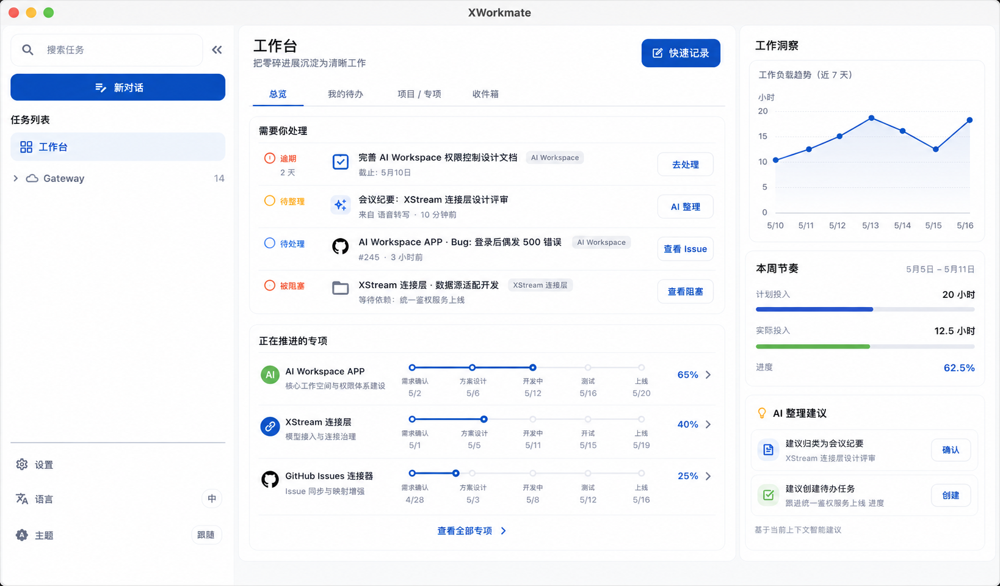
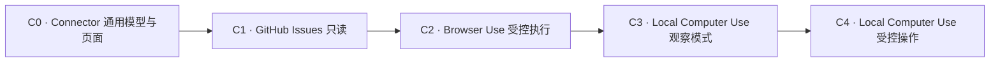

# AI Workspace 详细设计规划索引

> 日期：2026-07-28
> 原则：所有新增能力先完成详细设计评审，再进入代码实现。

## 总体规划

- [个人工作管理、学习能力与成果规划](./2026-07-28-personal-work-management-design.md)

## 工作台设计评审

第 4 稿以 macOS Desktop 三栏工作空间为基础，只新增一个一级入口“工作台”；入口内包含总览、我的待办、项目 / 专项与工作收件箱。

- 关联评审：[Issue #213 · Work Management 与内置学习闭环](https://github.com/ai-workspace-lab/xworkmate-app/issues/213)
- [macOS Desktop 工作台设计稿（第 4 稿）](./assets/workbench-macos-desktop-v4.png)

## 第一批 Connectors 详细设计

1. [GitHub Issues 只读连接器](./2026-07-28-github-issues-connector-detailed-design.md)
2. [开源 Browser Use 连接器](./2026-07-28-open-source-browser-use-connector-detailed-design.md)
3. [开源本地 Computer Use 连接器](./2026-07-28-open-source-local-computer-use-connector-detailed-design.md)

## 推荐实施顺序

原因：

- GitHub Issues 是结构化、只读、风险较低的首个连接器，可先验证连接器中心、授权、安全存储、状态和分页。
- Browser Use 的作用域仍可限制在独立浏览器会话，风险和平台耦合低于本地桌面控制。
- Local Computer Use 会接触真实屏幕、键鼠、文件和其他应用，必须在统一审批、审计和紧急停止能力完成后再开放操作。

## 共同产品约束

- Connector 是 Connect 层能力，不替代 Work 的本地事实模型。
- APP 负责连接管理、权限说明、状态、审批和结果展示。
- XStream 负责 Provider 发现、调用、事件流和协议标准化。
- Infra 负责隔离运行环境、日志、成本、资源限制和远程执行能力。
- 凭据只进入安全存储，不进入普通配置、日志、截图或 Artifact。
- 所有不可逆操作必须经过用户确认。
- 每个 Provider 都必须可禁用、可替换、可卸载。
- 首期禁止静默后台执行和无限范围访问。
